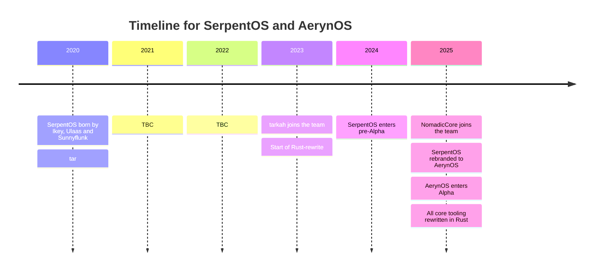

> To deliver modern tooling that allows for the creation and delivery of a performant atomic Linux distribution and is easy for the distribution team, its packagers and users alike. 
> — <cite>AerynOS Mission Statement</cite>

AerynOS is the collective output of brand new tooling built from the ground up to deliver a Linux distribution that focuses on reliability, proven performance and efficiency. Our ground up approach has allowed us to deliver on atomic updates without requiring reboots or having to utilise containers for package delivery. Part of our design philosophy is to deliver flexibility and customizability to end users. Examples of this includes:

- Imperative vs declarative
  - Imperative: By default, AerynOS utilizes an imperative approach for package management.
  - Declarative: Optionally able to use our system-model approach to declaratively control package installs
- Rolling Release vs Fixed Release
  - Rolling Release: AerynOS utilizes multiple repositories for a staged rolling release update process; users can choose to opt-in to the volatile branch or stay on the more stable "unstable" branch. The naming of the unstable branch is designed to remind users that our distribution is still in development and is not to be thought of as "stable".
  - Fixed Release: Using our system-model feature, users can opt to stick with the current (or any historic) tagged release more akin to Fixed Release distributions for stability.
- Filesystem agnostic
  - xfs: Our default recomendation as it currently performs the best based on our distributions' specific tooling.
  - ext4: Posible to use but has limitations in the number of moss states can be created and stored.
  - F2FS: Currently the worst performing FS on AerynOS but known to work.
  - TBC: Additional fileystems will be considered as the distribution moves towards a stable release.

## Project Timeline

## Choice of desktop environments


  
  
  
  
  
  

