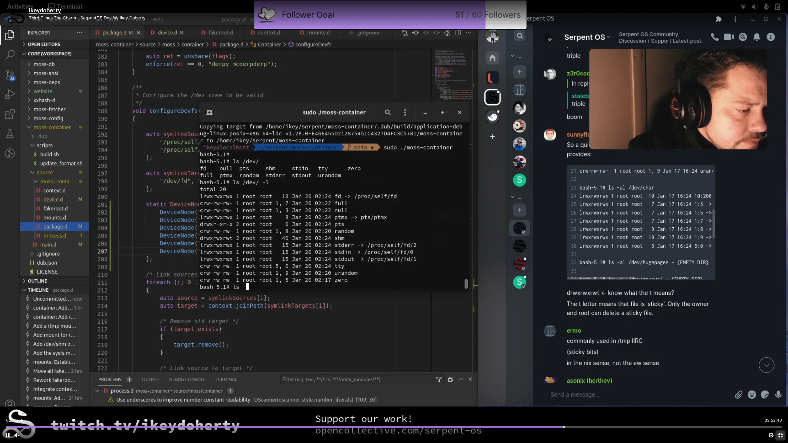

One of the core steps for building a package is setting up a minimal environment with only the required (and stated)
dependencies. Currently we have been building our stones in an `systemd-nspawn` container, where the root contains every
package that's been built so far. This makes the environment extremely difficult to reproduce!

<!--more-->

Today we announce `moss-container`, a simple but flexible container creator that we can integrate for proper
containerized builds.

## Versatile For Many Use Cases

Containers have a multitude of uses for a Linux distro, but our immediate use case is for reproducible container builds
for `boulder`. However, we have plans to use `moss-container` for testing, validation and benchmarking purposes as well.
Therefore it's important to consider all workloads, so features like `fakeroot` and `networking` can be toggled on or
off depending on what features are needed.

`moss-container` takes care of everything, the device nodes in the `/dev` tree, mounting directories as `tmpfs` so the
environment is left in a clean state, and mounting the `/sys` and `/proc` special file-systems. These are essential for
a fully functioning container where programs like `python` and even `clang` won't work without them. And best of all,
it's very fast so fits in well with the rest of our tooling!

The next step is integrating `moss-container` into `boulder`, so that builds become reproducible across machines, and
makes it much easier for users to run builds on their host machines.

## moss Now Understands Repositories

Previously (but not covered in the blogs) work was also done on `moss` so that it can understand and fetch `stone`
packages from an online repo. This ties in nicely with the `moss-container` work and is a requirement for finishing up a
proper build process for Serpent OS. We are now one step closer to having a full distribution cycle from building
packages and pushing those packages as system updates!

## Check Out The Development

In case you've missed it, `ikey` has been streaming some of the development of the tooling on his
[Twitch channel](https://www.twitch.tv/ikeydoherty). DLang is not as commonly used as other languages, so check it out
to see the advantages it brings. Streams are typically announced on twitter, or give him a follow to see when he next
goes live!

## Bonus Content Refresh

This year we've had a considerable number of new visitors and interest in Serpent OS. Unfortunately the content on the
website had been a bit stale and untouched for some time. There was some confusion and misunderstanding over some of the
terms and content. Some of the common issues were:

- Subscriptions is a loaded term relating to software
- Subscriptions only referred to a fraction of the smart features
- Seemed targeted at advanced users with too many technical terms
- Lack of understanding around what moss and boulder do
- That features would add complexity when the tools were actually removing the complexity

The good news is that a good chunk of it has been redone, including two new pages for our core tools `boulder` and
`moss`. `Subscriptions` has been renamed to `Smart System Management` to reflect its broader nature (which you can read
about [here](/smart)).

Much of the content has also had a refresh or a rewrite, so if you've seen it before, it will likely be a lot easier to
digest now. But this isn't the final state of the content, as more features will need to be added and there's still a
few rough edges (and I like to rewrite things every once in awhile). Many ideas have been raised by our community in the
[matrix channel](https://matrix.to/#/#serpentos:matrix.org), so a shout-out to the good folks we have hanging out there.
