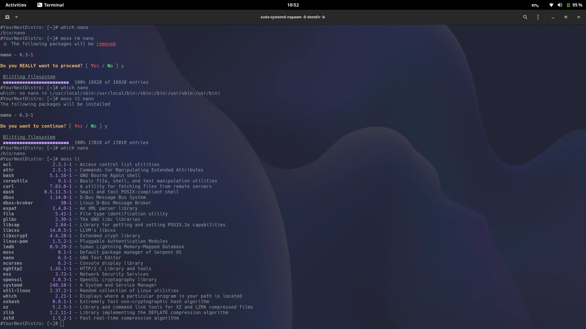
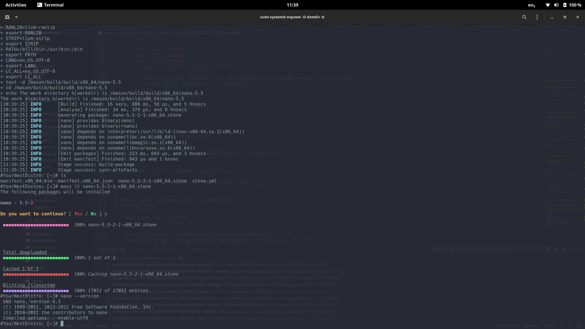

Well - we've got some big news! The past few weeks have been an incredibly busy
time for us, and we've hit some major milestones.

<!--more-->

## Funding

After much deliberation - we've decided to pull out of Open Collective. Among other reasons, the fees
are simply too high and severely impact the funds available to us. In our early stages, the team consensus
is that funds generated are used to compensate my time working on Serpent OS.

As such I'm now moving funding to my own [GitHub Sponsors](https://github.com/sponsors/ikeycode?o=sd&sc=t) page - please do migrate! It ensures your entire
donation makes it and keeps the lights on for longer =) Please remember I'm working **full time** on Serpent OS
exclusively - I need your help to keep working.

## Moved to GitHub

We've pretty much completed our transition to GitHub. We've now got the following organisations:

 - [snekpit](https://github.com/snekpit) - Packaging work
 - [serpent-os](https://github.com/serpent-os) - Main code development (moss/boulder/etc)

## Forums

Don't forget - our forums are **live** over at [forums.serpentos.com](https://forums.serpentos.com) - please feel
free to drop in and join in with the community =)

## Rehash on the tooling

OK so what exactly *are* `moss` and `boulder`? In short - they're the absolute core pieces of our distribution model.

## "What is moss?"

On the surface, moss looks and feels roughly the same as just about any other traditional package manager out there.
Internally, however, its far more modern and has a few tricks up its sleeve. For instance, every time you initiate
an operation in moss, be it installation, removal, upgrade, etc, a new filesystem transaction is generated. In short,
if something is wrong with the new transaction - you can just boot to an older transaction when things worked fine.

Now, it's not implemented using bundles or filesystem specific functionality, internally its just intelligent use of
hardlinks and deduplication policies, and we have our own container format with zstd based payload compression. Our
strongly typed, deduplicating binary format is what powers moss.

Behind the scenes we also use some other cool technology, such as LMDB for super reliable and speedy database access.
The net result is a next generation package management solution that offers all the benefits of traditional package
managers (i.e. granularity and composition) with new world features, like atomic updates, deduplication, and repository
snapshots.

## boulder

It's one thing to manage and install packages, it's another entirely to **build them**. `boulder` builds conceptually
on prior art such as `pisi` and the `package.yml` format used in `ypkg`. It is designed with automation
and ease of integration in mind, i.e. less time spent focusing on **packaging** and more time on actually
getting the thing building and installing correctly.

Boulder supports "macros" as seen in the RPM and ypkg world, to support consistent builds and integration.
Additionally it automatically splits up packages into the appropriate subpackages, and automatically scans
for binary, pkgconfig, perl and other dependencies during source analysis and build time. The end result
is some `.stone` binary packages and a build manifest, which we use to flesh out our **source package index**.

## Major moss improvements

We've spent considerable time reworking `moss`, our package manager. It now features
a fresher (terminal) user interface, progress bars, and is rewritten to use the
[moss-db](https://github.com/serpent-os/moss-db) module encapsulating LMDB.



It's also possible to manipulate the binary collections (software repositories)
used by moss now. Note we're going to rename "remote" to "collection" for consistency.

At the time of writing:

```bash
$ mkdir destdir
$ sudo moss remote add -D destdir protosnek https://dev.serpentos.com/protosnek/x86_64/stone.index
$ sudo moss install -D destdir bash dash dbus dbus-broker systemd coreutils util-linux which moss nano
$ sudo systemd-nspawn -b -D destdir
```

This will be simplified once we introduce `virtual` packages (Coming Soon &trade;)

## Local Collections

Boulder can now be instructed to utilise a local collection of stone packages, simplifying the development of large stack items.

```bash
sudo boulder bi stone.yml -p local-x86_64
```

Packages should be moved to `/var/cache/boulder/collections/local-x86_64` and the index
can be updated by running:

```bash
sudo moss idx /var/cache/boulder/collections/local-x86_64
```


## Self Hosting

Serpent OS is now officially self hosting. Using our own packages, we're able to
construct a root filesystem, then within that rootfs container we can use our own
build tooling (`boulder`) to construct **new builds** of our packages in a nested
container.

The `protosnek` collection has been updated to include the newest versions of moss
and boulder.




## Booting

As a fun experiment, we wanted to see how far along things are. Using a throwaway
kernel + initrd build, we were able to get Serpent OS booting using virtualisation (`qemu`)


## ISO When?

Right now everyone is working in the [snekpit](https://github.com/snekpit) organisation to
get our base packaging in order. I'm looking to freeze `protosnek`, our bootstrap collection,
at the latest of tomorrow evening.

We now support layered, priority based collections (repositories) and dependency solving across
collection boundaries, allowing us to build our new `main` collection with `protosnek` acting as
a bootstrap seed.

Throughout this week, I'll focus on getting Avalanche, Summit and Vessel into shape for PoC so
that we can enjoy automated builds of packages landing in the yet-to-be-launched `volatile` collection.

From there, we're going to iterate + improve packaging, fixing bugs and landing features as we
discover the issues. Initially we'll look to integrate **triggers** in a stateless-friendly
fashion (our packages can only ship `/usr` by design) - after that will come boot management.

An early target will be Qemu support via a stripped `linux-kvm` package to accelerate the bring up,
and we encourage everyone to join in the testing. We're self hosting, we know how to boot, and
now we're able to bring the awesome.

I cannot stress how important the support to the project is. Without it - I'm unable to work full
time on the project. Please consider supporting my development work via [GitHub Sponsors](https://github.com/sponsors/ikeycode?o=sd&sc=t).

> I'm so broke they've started naming black holes after my IBAN.

Thank you!

You can discuss this blog post over on [our forums](https://forums.serpentos.com/d/20-the-big-update)
