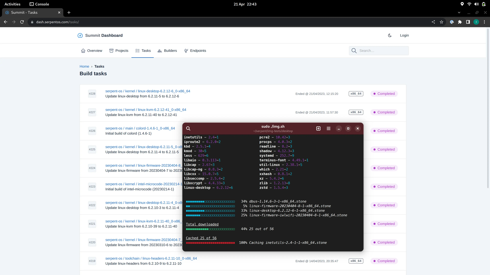

We had intended to get a blog post out a little bit quicker, but the last month has been extremely
action packed. However, it has paid off immensely. As our friends at Solus [recently announced](https://getsol.us/2023/04/18/a-new-voyage/)
it is time to embark on a new voyage.

<!--more-->

### General gist of it

There is very little point in rehashing the post, so I'll cover the essentials

 - We assisted the Solus team in deploying a complete new infrastructure. Some of this work is ongoing
 - The package delivery pipeline is in place, meaning updates will soon reach users.
 - We're working towards a mutually beneficial future whereby Solus adopts our tooling.

### Is Serpent OS over?

Oh no, no. The most practical angle to view this from is that Serpent OS is free to build and innovate to create the
basis of Solus 5. Outside of the distribution we're still keen to continue development on our tooling
and strategies.

It is therefore critical that we continue development, and find the best approach for both projects, to make
the transition to Solus 5 as seamless as possible. To that end we will still need to produce ISOs and have an
active community of users and testers. During this transition period, despite being two separate projects, we're both
heading to a common goal and interest.

### Finances

We have an exciting journey ahead for all of us, and there are many moving parts involved. Until we're at the point
of mutual merge, we will keep the entities and billing separate. Thus, funds to the Solus [OpenCollective](https://opencollective.com/getsolus)
are intended for use within Solus, whereas we currently use [GitHub Sponsors](https://github.com/sponsors/ikeycode?o=sd&sc=t)
for our own project needs.

Currently Solus and Serpent OS share one server, which was essential for quick turnaround on infrastructure enabling.
At the end of this month Serpent OS will migrate from that server to a new, separate system, ensuring the projects
are billed separately.

Long story short, if you wish to sponsor Serpent OS **specifically**, please do so via [our GitHub sponsors account](https://github.com/sponsors/ikeycode?o=sd&sc=t) as our monthly running costs
will immediately rise at the end of this month. If you're supporting Solus development, please do visit them and sponsor them =)

### Next steps?

Glad you asked! Now that the dust is settling, we're focusing on Serpent OS requirements, and helping Solus where we can.
Our immediate goals are to build a dogfooding system for a small collection of developers to run as an unsupported prealpha
configuration, allowing us to flesh out the tooling and processes.

This will include a live booting GNOME ISO, and sufficient base packages to freely iterate on `moss`, `boulder`, etc as well
as our own infrastructure. Once we've attained a basic quality and have an installer option, those ISOs will be made available
to you guys!
