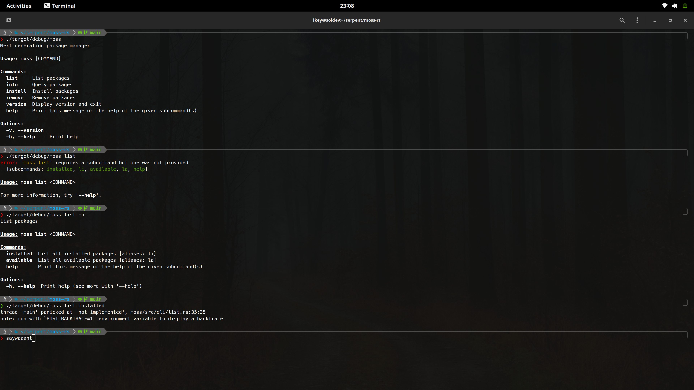

Allow me to start this post by stating something very important to me: I absolutely love the
D programming language, along with the expressivity and creative freedom it brings. Therefore
please do not interpret this post as an assassination piece.

For a number of months now the Serpent OS project has stood rather still. While this could naively
be attributed to our shared plans with [Solus](https://getsol.us) - a deeper, technical issue is
to be acredited.

<!--more-->

## D isn't quite there *yet*. But it will be, some day.

Again, allow me to say I have thoroughly enjoyed my experience with D over the last 3 or so years,
it has been truly illuminating for me as an engineer. With that said, we have also become responsible
for an awful lot of code. As an engineering-led distribution + tooling project, our focus is that of
secure and auditable code paths. To that extent we pursued [DIP1000](https://github.com/dlang/DIPs/blob/master/DIPs/other/DIP1000.md) as far as practical and admit it has a way to go before addressing our immediate needs of memory safety.

While we're quite happy to be an upstream for Linux distributions by way of release channels and tooling
releases, we don't quite have the resources to also be an upstream for the numerous D packages we'd need to
create and maintain to get our works over the finish line.

With that said, I will still continue to use D in my own *personal* projects, and firmly believe that one day
D will realise its true potential.

## Rewarding contributors

Our priorities have shifted somewhat since the announcement of our shared venture with Solus, and we must make
architectural decisions based on the needs of all stakeholders involved, including the existing contributor pool.
Additionally, care should be taken to be somewhat populist in our choice of stacks in order to give contributors
industry-relevant experience to add to their résumé (CV).

## Playing to strengths

Typically Solus has been a Golang-oriented project, and has a number of experienced developers. With the addition
of the Serpent developers, the total cross-over development team has a skill pool featuring Rust and Go, as well as
various web stack technologies.

Reconsidering the total project architecture including our automated builds, the following decisions have been made
that incorporate the requirements of being widely adopted/supported, robust ecosystems and established tooling:

 - Rust, for low level tooling and components. Chiefly: `moss`, `boulder`, `libstone`
 - ReactJS/TypeScript for our frontend work (Summit Web)
 - Go - for our web / build infrastructure (Summit, Avalanche, Vessel, etc)

## Lets start... 2 days ago!

The new infrastructure will be brought up using widely available modules, and designed to be scalable from the outset
as part of a Kubernetes deployment, with as minimal user interaction as needed. Our eventual plans include rebuilding
the entire distribution from source with heavy caching once some part of the dependency graph changes.

This infrastructure will then be extended to support the Solus 4 series for quality of life improvements to Solus developers,
enabling a more streamlined dev workflow: TL;DR less time babysitting builds = more Serpent development focus.

Our priority these past few days has been on the new [moss-rs](https://github.com/serpent-os/moss-rs) repository where we
have begun to reimplement `moss` in Rust. So far we have a skeleton CLI powered by `clap` with an in-progress library for reading
`.stone` archives, our custom package format.

The project is organised as a Rust workspace, with the view that `stone`, `moss` and `boulder` will all live in the same tree.
Our hope is this vastly improves the onboarding experience and opens the doors (finally) to contributors.

### Licensing

It should also be noted that the new tooling is made available under the terms of the Mozilla Public License ([MPL-2.0](https://spdx.org/licenses/MPL-2.0.html)).
After internal discussion, we felt the MPL offered the greatest level of defence against patent trolls while still ensuring our code
was widely free for all to respectfully use and adapt.

Please also note that we have always, and continue to deliberately credit copyright as:

    Copyright © 2020-2023 Serpent OS Developers

This is a virtual collective consisting of all whom have contributed to Serpent OS (per git logs) and is designed to prevent us from
being able to change the license down the line, i.e. a community protective measure.

## Glad to be back

Despite some sadness in the change of circumstances, we must make decisions that benefit us collectively as a community.
Please join us in raising a virtual glass to new pastures, and a brave new `blazing fast 🚀` (TM) future for Serpent OS and Solus 5.

Cheers!
