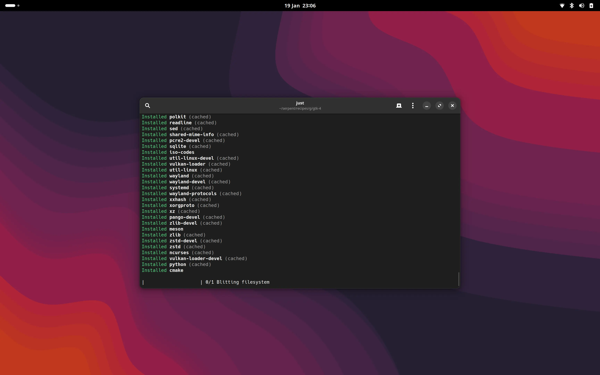

Precisely one month since our end of year summary, so, what have we been up to?
With a new year, a new start was long overdue. We're pleased to announce that we've
finally shifted our butts over to our own server (again).

While this isn't quite as chunky a news update as the last post, we rather hope you appreciate
the regularity of the news.

<!-- more -->

## Infrastructure, revisited

'tarkah' has been tirelessly porting `moss-service`, the core foundation of our automated build system,
to a shiny new Rust codebase. While we don't have an *immediately* pressing need for the port to
come online, it will certainly address some "v1 issues" and ensure the best-in-class development
experience for our contributors.

## Licensing

In our pursuit for a sustainable, community oriented project, we've been doing a lot of in house organisation.
Very importantly, we've now [relicensed](https://github.com/serpent-os/recipes/issues/2) our packaging recipes to [MPL-2.0](https://spdx.org/licenses/MPL-2.0.html), bringing them in line with the license chosen for our current engineering efforts (`moss`, etc).

To reiterate a critical point, we require that our contributions are attributed to the virtual collective "Serpent OS Developers"
to ensure we're unable to relicense any contributions *without express consent of the contributors involved*.

Additionally we picked MPL-2.0 over Zlib due to some distinct advantages in relation to patent trolls. In combination
we believe both the project and our users will have the greatest protection from patent trolls and fiscally-motivated
relicensing.

## As I Raise My Trigger Finger

As you may recall from the last post, we announced our intention to add system triggers to moss.
We also stated that our triggers must run in **isolation** thanks to the unique architecture of our
package management. After much consideration, we've landed on a strategy that will work for us.

### Post-blit triggers

Every *mutable operation* in moss results in a fresh internal transaction, which is present as a full
`/usr` tree inside a staging tree. The majority of triggers can be executed here, just before we "activate"
the new rootfs. This allows us to detect potential trigger failures, and abort the activation.

These YAML-defined triggers will be run in an isolated environment (clone-based container) with the new `/usr`
and read-only access to `/etc`.

### Post-activation triggers

Once we have a freshly activated `/usr` (ie new system view) we can run a very limited set of post-activation
triggers. An obvious example may be `systemctl daemon-reexec`. Note that by splitting post-blit and post-activation
triggers, we leave the door open to multiple activation strategies for non-simple updates, including soft reboots
and kernel patching.

## Packaging updates!

With all of the migration work, our builds have also resumed. In the space of a few short days we've had 32 package
builds. Ok, not a huge number, but we also have 15 outstanding pull requests to our new recipes repo!

In order to make life not only simpler for us, but for Solus in its future role as a source-derivative of Serpent, we've
unified all of our git recipe repos into a new single repo, [recipes](https://github.com/serpent-os/recipes).

## Improved hosting

Our devops team has been working hard to mitigate bus factor with our transition to the new infrastructure, Bitwarden account,
shared DNS, and opentofu configuration.

### Self Hosting. Again

As part of the recovery process for Solus, the two projects shared resources, including
a large Hetzner node. This has actually worked remarkably well for a long time now, however
with Serpent growing we do not wish to impact the *availability* and *stability* of the Solus
update experience.

Long story short, money from [GitHub Sponsors](https://github.com/sponsors/ikeycode) (You guys! <3) is now paying for an AX52 server
from Hetzner. It's sufficiently powerful that we're running a backup *builder* there as well as
repo management and build controller.

### El Cheapo Web Hosting

Looking at our project's use of static generators - we decided to review our hosting for web content.
Long story short, we deemed it entirely unnecessary. We're now using GitHub pages to deploy this
website and our [documentation site](https://docs.serpentos.com) via GitHub actions. Don't worry,
we use git, we have backups, and we manage the infrastructure using `IaC` practices.

## Clarifying our baseline target

Lately there have been some questions in both Serpent and Solus as to what our baseline will be.
In Serpent OS, this will be at minimum `x86_64-v2`, with `x86_64-v3x` packages automatically
offered if the system base criteria are met.

This decision has been made to offer the widest baseline compatibility without compromising heavily
on system performance (Such that `x86_64-generic` is unsupported in Serpent OS). We will continue
offering both `v2` and `v3x` until it is no longer feasible from a storage/financial perspective.
Source derivatives (Including Solus) are free to chart their own course here, if necessary,
and still benefit from tight upstream integration.

### Towards Next Month

In our next update, we'll have quite a bit to cover, including:

 - Integrated triggers
 - Progress with GNOME packaging/readiness
 - Boulder / Infrastructure porting progress
 - Actually useful Serpent images
