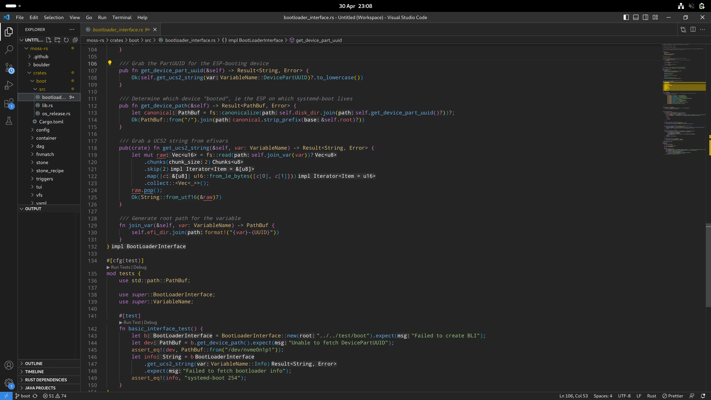

It's that time of month again, and we have some details to share with you on boot management, as well as plans for real installs
landing in May. Additionally, plans for "deferred updates" via mandatory reboots have been dropped!

<!--more-->

## Project priorities

To better understand the technical deep-dive on boot management further below, we should clarify a slight change in priorities
for the project as a whole. For some time now we've served as a technical beacon for Solus to guide them towards better strategy
and technical solutions whilst awaiting a situation where a rebase is feasible.

While we still look forwards to that future, the present day is the most important to us. Serpent OS must now transition from
a collection of tools and promises into a daily driver with actual users. We still aim to cater to the more developer/technical oriented
end of the spectrum rather than a "desktop distro", and want to start this journey yesterday.

The boot management code is currently landing over the coming days, and will be immediately followed by an incredibly rudimentary
system installer to facilitate an initial adoption of Serpent OS for the general public. Our intent is to ship some early test ISOs
for supporters, and by the end of May have a feasible option for people to use and contribute to Serpent OS on real hardware.

We acknowledge this is an exchange of the pursuit of perfection for a pragmatic rapid iteration cycle and believe the best way
forward is to open the doors wide, fixing issues on the job. The initial system will likely be rough and buggy, but it is an official
starting point from which we can all build Serpent OS together.

## Moss + Boulder

Our Rust tooling has now been in "production" use in our development environment and build servers for the last month
without any major hiccup. We have recently discovered some minor issues in our `emul32` (32-bit) package generation which
are being resolved, chiefly our move from the improperly named ISA `x86`, now updated to `386` affecting 32-bit dependency
chains.

## Boot

Our main topic of conversation this month is the enabling of _boot management_ for Serpent OS installations. To be crystal
clear, we are not talking about a boot loader. In fact, Serpent OS uses `systemd-boot` for UEFI. Instead, we are talking
about the automated management of boot loader *entries*, their corresponding kernel/initrd assets, cleanup from old states, etc.

In a former life I authored the `clr-boot-manager` tool to manage this in an agnostic fashion and this served well for a number
of years. However, existing as an externally invoked binary meant that the tool had to become responsible for all accountancy and
asset lifetimes.

### Enter ... moss-boot

Ok - technically it's `crates/boot` in the moss repo. This is a Rust crate that will be integrated into the main `moss` project to
provide the aforementioned boot management facilities. A huge advantage for us is that moss can only allow a single version of a package
to exist within a given state, and all states are numerically identified due to the transaction nature of our package manager.

In simple terms, one "state" == "one kernel candidate" (per type..) so all we *really* need to do for now is identify the `ESP` in use by
way of the [Boot Loader Interface](https://systemd.io/BOOT_LOADER_INTERFACE/) and any `XBOOTLDR` partition. Then, map our "boot environment"
into something `moss-boot` can convert into boot entries, and voila..

At a more technical level, moss-boot will handle the following:

 - form candidate `cmdline` from filesystem snippets
 - auto-generate the `root=` parameter by probing the `/` partition (LVM2, etc)
 - record the `initrd` needed
 - compare and atomically write "missing" files in FAT-respecting fashion (copy/unlink/rename)
 - garbage collect unused boot entries

### Live atomic updates and kernels...

An interesting, perhaps not widely considered result of upgrading a kernel, is filesystem path changes. If for any reason the kernel's module
tree becomes inaccessible (say, due to updating to a new version) then it becomes impossible to load the old kernel modules. To remedy this, distributions will
tend to leave multiple versions of the kernel on disk, invariably within mounted `/boot`.

The approach Serpent OS is taking will mean that like Solus, `/boot` will not need to be premounted nor will any package ship files in that directory.
Unlike the existing design in Solus 4, we will not leave kernels behind on upgrade. Instead, they become locked to the system state (transaction) in which
they are used.

To solve the "missing version" issue, we will have `moss` record the qualified snapshot path (in `/.moss`) within the `/run` tree so that once the `/usr`
tree has been swapped with a new transaction atomically, a patched `kmod` package will fall back to probing the suddenly orphaned kernel tree in the cached
`/run` location.

This will mean that the `/lib/modules` tree may not have the current kernel version, but the OS will still be usable while having had a live atomic update.
Of course, to *use* the new kernel you must reboot. Unlike other atomic OS implementations, it will be up to *you* when you do so: no more deferred updates!

## Next time

We are _aiming_ to get back to monthly blogs on the 19th, but the cycle for the coming 6 weeks may be quite interesting. Expect out of schedule posts
looking for testers and volunteers while we use Serpent OS to build Serpent OS, enabling a community of pioneers benefiting from the unique design of
our architecture: a full-featured OS featuring hermetic `/usr`, offline rollbacks, and live atomic upgrades with containerised system triggers.
