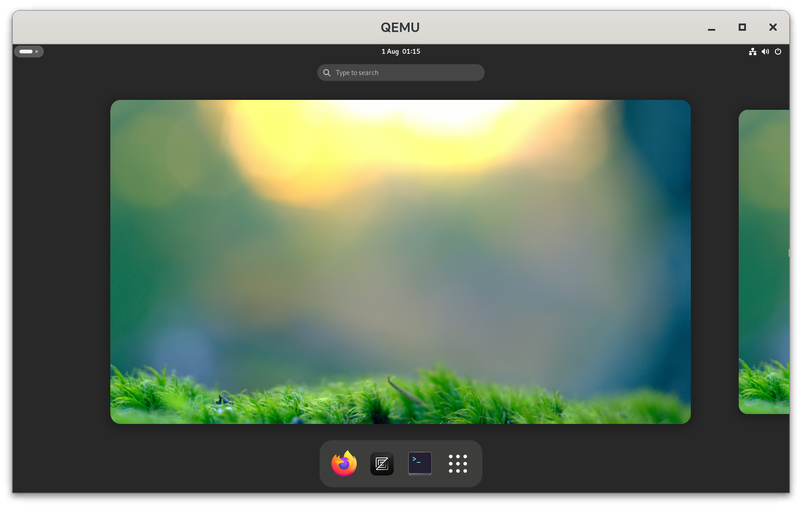

Well, it didn't take us that long, **really** ... Our technical preview, *prealpha0*, is now available for testing!



Head to our [download](/download) page to grab `serpent-os-prealpha-0.iso` now!

<!--more-->

This is a super rough version of Serpent OS that is *capable* of being installed on baremetal hardware and VMs that
support UEFI and OpenGL acceleration. It is however not *recommended* for use daily due to the early nature and a bunch
of packages being wildly out of date. It features a minimal GNOME desktop with the Firefox web browser and a terminal.

Right now it contains a CLI installer that can be accessed from the terminal by typing:

```bash
sudo lichen
```

To detract from casual use it is necessary to manually partition the disk before running the (net) installer. You can use
`fdisk` to create a GPT disk with a (mandatory) `EFI System Partition` and an optional `XBOOTLDR` partition. This currently
also needs to be FAT32 until we integrate systemd-boot driver support. Lastly of course you will need a large enough root
partition.

You will need a working network connection, so make sure you're connected before starting the installer!


## Technologies involved

This will of course appear to be a very rough (crap) prealpha ISO. Underneath the surface it is using the [moss](https://github.com/serpent-os/moss)
package manager, our very own package management solution written in Rust. Quite simply, every single transaction in moss generates
a new filesystem tree (`/usr`) in a staging area as a full, stateless, OS transaction.

### moss

When the package installs succeed, any *transaction triggers* are run in a private namespace (container) before finally activating
the new `/usr` tree. Through our enforced stateless design, `usr-merge`, etc, we can atomically update the running OS with a single `renameat2`
call.

As a neat aside, all OS content is deduplicated, meaning your last system transaction is still available on disk allowing offline rollbacks.

Translated: Like A/B swaps? Don't like rebooting? ... Ok that explained it.

### blsforme

A few crates deep we find [blsforme](https://github.com/serpent-os/blsforme) - a library for automatically managing the ESP and XBOOTLDR
partitions. Whenever kernels and associated files are present in the OS filesystem, they are synchronised to the boot partitions along
with automatically generated boot entries and cmdlines. Specifically this means moss can discover and mount necessary partitions according to
the disk topology, GPT entries, and Boot Loader Specification, generating configurations by scanning your local rootfs to build the proper
`root=` parameters for you.

Translated: Magic boot management makes way for offline rollbacks.

## Warning

Super **pre**-alpha. Will 100% break! We just wanted you for the journey <3

## Start of public iterations

Ok you have this super rough ISO, what next? We now have an actual *startpoint* and will continue to iterate on the ISOs,
delivering new installer updates/improvements and removing the unnecessary live mode from the ISO completely.

The next release will also feature more installer options so you can fresh-install the Cosmic Desktop (in repos now)
For the brave, go forth and `sudo moss sync -u` ! (ok you want `moss help` first.)

## Closing word

As a distro, it's kinda crap right now. The tooling has been our focus for years and now we can actually build something
with it. With only a handful of packages, `flatpak` is your best friend. Or you could swing a PR into our [recipes](https://github.com/serpent-os/recipes) repo!

The project is only possible with your support. Something tells me that putting out this ISO is going to somewhat increase
our hosting costs and stress the datacenter hamsters.

Feel free to [sponsor](https://github.com/sponsors/ikeycode) to support our work and increase our capacity!
