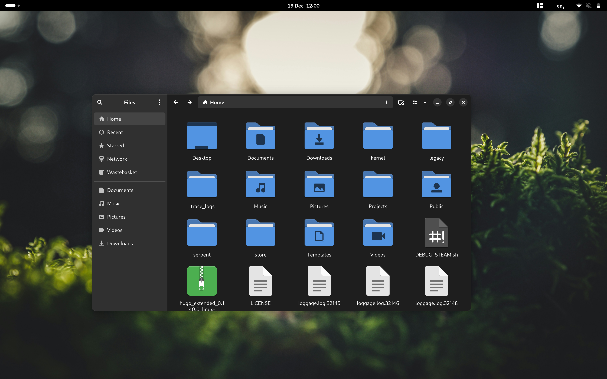
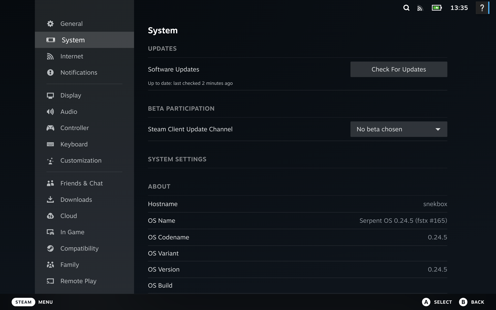

Following a successful prealpha phase, we're excited to announce that Serpent OS has now entered the alpha stage of development. This milestone marks a significant step forward in the project's journey.
While the usual disclaimers apply, as a certain level of project *fluidity is to be expected*, we invite you to explore the latest alpha release and experience the cutting-edge features and improvements we've introduced.

## Supporting Serpent OS

Serpent OS is a community-driven project, and we welcome contributions from developers, testers, and users alike. If you're interested in helping shape the future of Linux distributions, we invite you to join our growing community and get involved in the project. Whether you're interested in packaging, development, documentation, testing, or community support, there are many ways to contribute to Serpent OS.

Lastly, you can support the project by becoming a sponsor. Your support helps cover our hosting costs and allows us to dedicate more time to making Serpent OS exceptional. We're grateful for the support we've received so far and look forward to continuing to build something meaningful in the Linux ecosystem.

<a class="btn btn-sm btn-outline-light mt-3 mb-5" href="/sponsor">
  <i class="fas fa-heart me-2"></i> Sponsor Serpent OS
</a>

## What is Serpent OS?

Serpent OS is a heavily engineering-led Linux distribution seeking to redefine *how* we distribute Linux.
It is a stateless OS that leverages atomic updates, cutting-edge tooling, and rock-solid reliability to deliver a safe and efficient system. Built by industry veterans with decades of experience, Serpent OS represents the next evolution in Linux distributions.

We currently offer x86_64-v2 desktop builds, for both GNOME and COSMIC desktop environments. We only support UEFI systems, and plan secure boot support via `shim` in the near future. The majority of the distribution (including the kernel) is built against the LLVM toolchain, with libc++ as the default C++ standard library.

Through our unique architecture, we've combined proven concepts into a cohesive system where updates either fully complete or safely roll back, keeping your system running reliably. Our atomic updates let you see changes immediately, without requiring reboots just to apply updates. While certain updates like kernels will still need a reboot, we've designed Serpent OS to be as seamless and user-friendly as possible.

## What's new in the alpha release?

The alpha release introduces several key features and improvements that enhance the overall user experience and system performance. Here are some highlights of what you can expect from Serpent OS alpha:

### Hardware support

We've rounded out our hardware support, now including patches for ASUS devices and Surface devices. Additonally, we now have the NVIDIA driver available in the repositories.
Note we only offer [open-gpu-kernel-modules](https://github.com/NVIDIA/open-gpu-kernel-modules), which we prebuild against our `linux-desktop` package to streamline
installation.

### Steam

You can now install Steam from our repos, making use of our newly enabled multilib drivers:

 - mesa-32bit
 - nvidia-graphics-driver-32bit

### More Rust

As part of our efforts to modernise and strengthen the Serpent OS base, we've switched some components out for Rust alternatives:

 - `uutils-coreutils` replaces `coreutils`
 - `sudo-rs` replaces `sudo`
 - `ntpd-rs` replaces `timesyncd`
 - `curl` is built with `rustls` support (and `hyper` but this is being dropped upstream)

Additionally we include `starship` by default on our GNOME ISO, along with `zed`, `loupe`, `resources` and other Rust applications.

### Packages

Our `recipes` repository has seen over 1600 commits since our prealpha, with some of the highlights including:

 - Linux 6.12.6
 - Firefox 133.0.3
 - LLVM 18.1.8
 - GNOME 47.2
 - COSMIC 1.0.0_alpha4

## Tooling updates

We've made significant improvements to our tooling, including updates to `moss`, `boulder`, and `blsforme`. These tools are essential for managing packages, building software, and handling boot management in Serpent OS.

### moss - Package Management

Our atomic package manager swaps the entire `/usr` directory during system updates, ensuring a stateless, bulletproof upgrade process. Updates either succeed completely or not at all.
Recently we made improvements to `moss` to handle certain special cases:

 - `EMLINK` - `ext4` is limited to 65k hardlinks per inode, and we were hitting this limit on some systems due to empty files. We now handle this case gracefully by creating new inodes for empty files.
 - `ENOSPC` - We now mitigate the risk of `ENOSPC` on the boot partition by performing automatic cleanup of old kernels and initrds. This paves the way for us to land transaction-specific entries for the offline rollback feature.

### blsforme - Boot Management

Automated boot management that just works. Seamlessly handles your EFI System Partition and boot entries without manual intervention.

We've improved blsforme to support drop-in command line snippets for kernel parameters, allowing for easy customisation of boot entries.
These can be supplied by packages, or by the user directly. This has allowed us to make `plymouth` work out of the box, in tandem with our
prebuilt reproducible initrd images.

We also now support multiple initrd images, which in turn allowed us to land support for early KMS in the initrd for NVIDIA users.

### lichen - Installer

We've revamped the UI for Lichen, and now allow picking between xfs, ext4, and f2fs for the root filesystem. The team advises against ext4 for systems where more than a few hundred
transactions will need to be retained, due to ext4 limitations with hardlink counts.

### Sync protections

In preparation for "versioned repositories", we've added a gate to prevent the automatic builds on our infrastructure from directly reaching users. Once we're happy with our validation, we
then "sync" the repositories to the public mirrors. This ensures that users are not exposed to any potential issues with the latest builds.

## What's next?

With us now entering the alpha phase, we're looking to grow our contributor base and community. Our immediate focus is improving/creating documentation to enable more people to use Serpent OS
as a daily driver in the near future. We're also going to keep iterating on our tooling, ensuring a reliable and efficient system for all users.

We'll begin deeper integration of the tooling, such as `moss` with `packagekitd` for GNOME Software and COSMIC Store use.

## Issues and feedback

If you encounter any issues or have feedback to share, please don't hesitate to reach out to us. You can report bugs on our [GitHub issue tracker](https://github.com/serpent-os/recipes/issues) or join our [Matrix space](https://matrix.to/#/!trFJOzhpDUejJKnPYg:matrix.org) to chat with other users and developers.

We are aware of some known issues in the alpha release, and we're actively working to address them in future updates. Your feedback is invaluable to us, and we appreciate your help in making Serpent OS the best it can be.

 - Performance of `moss` reduced significantly in VMs on first run
 - NVIDIA driver not working on some systems
 - Lichen still deliberately limited to "seeing" pre-formatted partitions. Requires `GPT` disk, with `ESP` and `/` partitions pre-created.
 - Lichen locked to net install mode, a `moss export` functionality will be added in the future to address this.
 - XBOOTLDR partition (`fat32`, `bls_boot` flag in gparted) of 2GB recommended for ideal boot management
 - Small repos - deliberate, to ensure maintainer story is solid before we scale up
 - Secure boot support pending secure key distribution support within the build infrastructure
 - Due to how our atomic upgrades work using `renameat2`, GNOME Shell doesn't currently detect new applications (`.desktop`) files when installed, requiring a reboot. We're working on a fix for this.

## Finally

We're excited to share the alpha release with you and look forward to your feedback and contributions. Thank you for your continued support and interest in Serpent OS. We're committed to building a safe, efficient, and reliable system that empowers users to get the most out of their computing experience.
