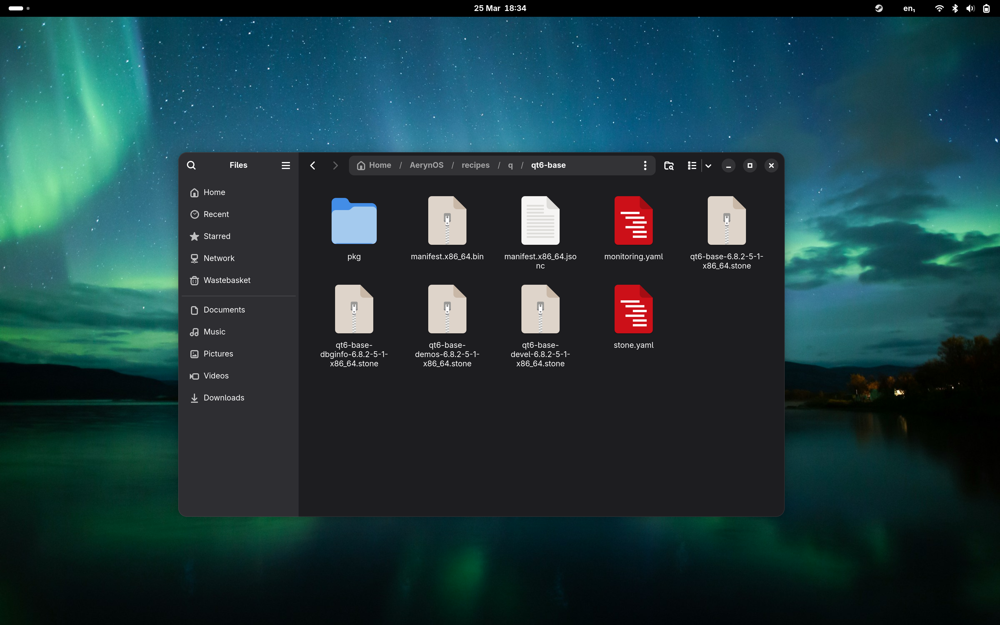

import YouTube from "@/components/ui/YouTube.astro";
import Kofi from "@/components/ui/Kofi.astro";

Hello from AerynOS! ✨ As you recall from February, we set about rebranding Serpent OS into what you now see,
AerynOS. It's not been without challenges, and where possible we've ensured continuity. Additionally we silently
dropped a few ISOs, and can now take our first formal steps under our new identity. TLDR: the transition has been entirely
fluid and you only need to keep updating, no manual intervention is necessary! 🎉

Progress has been steady but quiet lately, as due to unfortunate circumstances I've been working in bursts from my wifes
hospital bedside.

## 💿 But first, an ISO drop!

OK, lets get right to it. We've released AerynOS 2025.03, with the following shinies:

 - 🖥️ GNOME 48.0
 - 🐧 Linux 6.13.8
 - 🦊 Firefox 136.0.2
 - 🎮 Mesa 25.0.2
 - 🚀 Vulkan SDK 1.4.309.0
 - 🛠️ LLVM 19.1.7

We've also decoupled the internal tooling version from the ISO versions to make them a little bit more.. well.. *readable*,
for humans.

Grab it now from the [download](/download) page.




## 💰 Funding

I want to thank everyone for their support of the project since we got more transparent around goals. It's been a huge help and has
facilitated massive progress on the project! 🙏 AerynOS no longer feels like a hacked together PoC, but a a very solid daily runner. Yes,
it's certainly alpha, and the installer leaves a lot to be desired. For daily use and updates? It's really quite something.

Please note that I never realised the Ko-fi goals don't automatically reset, so the currently listed goal has been running for way more than
a month.. xD However, over a period of time, we did manage to achieve it! 🎉 I'll be resetting it shortly on a fixed date for each month ahead.

<Kofi />

## 🔄 Rebranding, the sane way.

Rebranding can be more challenging than one expects. The easy stuff is out of the way, HTTP redirects and DNS trickery
to ensure old URLs continue to work without manual intervention. In the case of the repos, we've updated the scheme:

### 🧪 Unstable presync repos

`packages.serpentos.com` -> `packages.aerynos.dev`

### 🌟 Post-sync user-facing repos

`dev.serpentos.com` -> `packages.aerynos.com`

### 📚 Documentation site

`docs.serpentos.com` -> `aerynos.dev`

Note the former scheme made *no sense* at all whereas now we take advantage of the `dotdev` for unstable work. A future release
of `moss` will automatically handle the transition on installs for the sake of consistency.

### 📊 Introducing `os-info`

Previously we had `moss` generate the `/usr/lib/os-release` file on demand using compiled in defaults, which was somewhat inflexible.
Now, we ship a JSON file (`/usr/lib/os-info.json`) containing a description of the OS, the composition of technologies, and the capabilites.
While `os-release` and `lsb_release` exist, they provide very primitive identification and metadata. `os-info` is designed to provide compatibility
with those formats while being far more expressive. Importantly, it also contains a mechanism for identifying the **former identities** of
an operating system:

```json
...
"former_identities": [
  {
    "id": "serpentos",
    "name": "Serpent OS",
    "start_date": "2020-06-15T00:00:00Z",
    "end_date": "2025-03-17T00:00:00Z",
    "end_version": "0.24.6",
    "announcement": "https://aerynos.com/blog/2025/02/14/evolve-this-os/"
  }
]
...
```

`moss` now utilises `os-info` to generate the `os-release` file, as well as to provide identification and history for our [blsforme](https://github.com/AerynOS/blsforme) crate
to manage each entry on the boot partition. This has allowed us to sync the branding on a per transaction basis, while still "owning" the
legacy branded transactions on the ESP too (i.e `/EFI/serpentos`) and ensure they are correctly garbage collected. Interestingly this means that for
a short period of time the boot menu will still show some of the older Serpent OS entries, allowing you to roll back to it.

Please visit the [os-info](https://github.com/AerynOS/os-info) repository for more details, the schema, etc. We're very keen to open collaboration and adoption of this project, envisaging
use cases in installers, welcome apps, and indeed even container introspection tooling.

## 🔧 Installer progress

We've officially begun the revamp of [lichen-installer](https://github.com/AerynOS/lichen-installer) using a proper split between
the privileged backend and frontend. In order to permit a number of frontends and use cases in future, we're using `tonic` gRPC messages
to communicate, currently just on a UNIX domain socket. In future, we'll have use cases for TCP using WASM frontend.

More importantly than that, we've now implemented the foundational aspects for [disks-rs](https://github.com/AerynOS/disks-rs).
Long story short - we're using provisioning strategies defined in custom `.kdl` files that are dynamically tested/validated against
an input storage pool to produce a working set of changes. Such as, create a new partition table and add some partitions to it, using
some constraints logic.

<YouTube title="AerynOS: Disk Provisioning" videoId="x5PMTmyYvXc"/>

It is early days, but its quite awesome that we're able to automatically partition disks based on these strategy files! ✨ These will form the
backbone of `lichen`, allowing us to offer rich automatic storage strategies as well as manual partitioning options. Notable is the ability to
set the `volid` or `uuid` of a specific filesystem, and `partuuid`, etc. This in essence allows shallow reproduction of an installation/disk topology
using a configuration file.

## 🙏 Acknowledgments

This transition wouldn't have been possible without our amazing community. Both long-time contributors and newcomers have stepped up to the plate to make AerynOS a reality, pushing us across the finish line during this critical transition.

Special thanks to Cameron for his instrumental work in porting our websites to a more maintainable, Astro-based infrastructure. This migration has not only improved our development workflow but also enhanced the user experience across all our web properties.

Whether you've contributed code, reported bugs, tested releases, spread the word, or supported us financially - thank you. AerynOS is truly a community effort, and we're excited to continue this journey together.

As always, you can join our community on [Matrix](https://matrix.to/#/#aerynos:matrix.org) or contribute on [GitHub](https://github.com/AerynOS).

## 🔄 Migration Guide

For existing Serpent OS users, migrating to AerynOS is straightforward:

1. Simply run the following command in your terminal:
   ```bash
   sudo moss sync -u
   ```

2. Some branding changes may require a second `moss` operation to fully "take" effect (as they'll be using the new moss binary). After the initial sync, run one of these commands to complete the transition:
   ```bash
   sudo moss sync
   # or
   sudo moss install some-package
   ```

That's it! Your system will seamlessly transition to AerynOS while maintaining all your existing configurations and installed packages.
## 🔮 Next up

We'll continue on the path we set at the start of the year. By and large we'll improve the core tooling to continue delivering a
better experience for users, developers, gamers, etc.

By the way, we *do* have `nvidia-open-gpu-kernel-modules` / `nvidia-graphics-driver` for the `linux-desktop` users wanting to game on their
shiny AerynOS installs. Our Steam package works great, and any feedback is appreciated on improving it (ie udev/controller stuff, 6.14 kernel is planned).

- Shifting more towards the installer images, using [Slint](https://slint.dev) for the installer frontend, and dropping unnecessary
packages from the installer image. Live ISOs will of course be available, but our primary target is installer images.
- Integration of [upstreams-rs](https://github.com/AerynOS/upstreams-rs) and ABI tracking into the tooling in order to vastly lighten the load
  for maintainers.
- Accelerated delivery of milestone ISOs.
