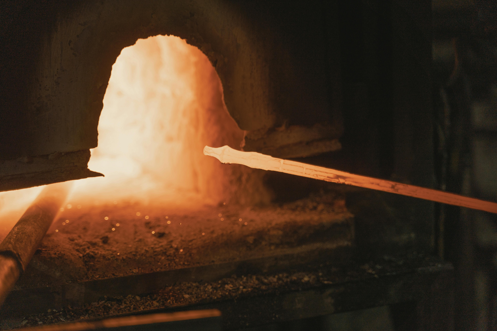
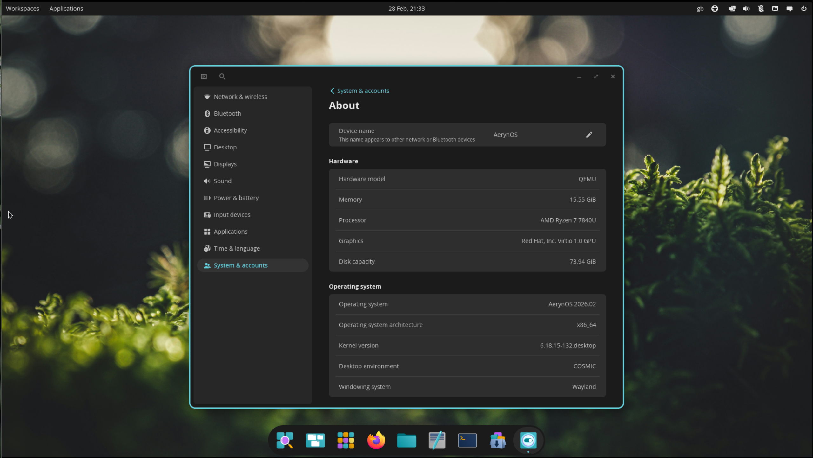
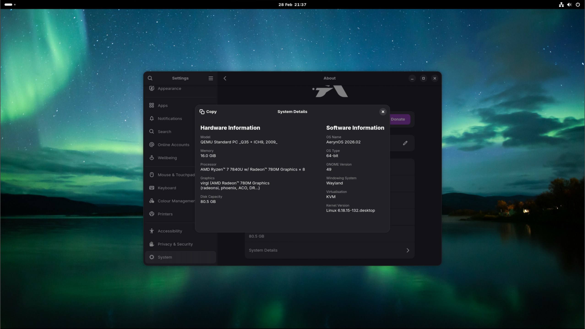
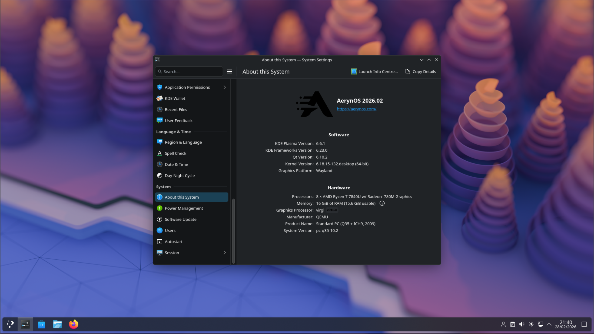

import Kofi from "@/components/ui/Kofi.astro";
import { Aside } from "@astrojs/starlight/components";

# AerynOS: February 2026 project update



February has been a busy month for the project with a lot of activity around our tooling and infrastructure. We have merged a number of smaller improvements, which have both led to an increase in useful features, correctness and maintainability. Moss has become significantly quicker in usage, boulder has seen improvements to help automate recipe creation & updates to a set standard, and our summit dashboard has seen improvements to better represent build queues live and dynamically in graphical form.

The website re-design is progressing nicely. Last month we shared that we are using the [Hextra theme](https://github.com/imfing/hextra). Over the last month, we have coordinated with the Hextra developer around conformance to [WCAG 2.2 Level AA](https://www.w3.org/TR/WCAG22/) (Web Content Accessibility Guidelines) and have been really impressed with their rate of development in this area.

Documentation has seen continued focus. We have reworked our FAQ section, the installation section has been re-written to make it clearer, and we have conducted a site-wide documentation spelling review to conform to American English.

We have also seen packagers becoming more active in helping flesh out the recipes repository and helping keep existing packages up-to-date.

During the last week of February, we have shared with our packaging community that we will likely be more focused on maintaining our existing set of packages and becoming more selective on adding new packages in the coming months, whilst our tooling capabilities mature to where they need to be for efficiently managing long term growth.

## What’s new in the distro

Package / stack updates for this iteration include:


- COSMIC 1.0.8
- GNOME 49.4
- KDE Frameworks 6.23.0
- KDE Gear 25.12.2
- KDE Plasma 6.6.1
- awww 0.11.2+git.2c86d41
- bazaar 0.7.10
- dankmaterialshell 1.4.3
- docker 29.2.1
- dracut 110
- firefox 148
- fish 4.5.0
- fresh 0.2.4
- ironbar 0.18.0
- jujutsu 0.38.0
- libinput 1.31.0
- linux 6.18.15
- lucien 0.1.0+git.ee18358
- mangowc 0.12.4
- mesa 26.0.1
- pipewire 1.6.0
- qemu 10.2.1
- riftbar 0.1.4
- thunderbird 148.0
- waybar 0.15.0
- wine 11.3
- yazi 26.1.22
- zoxide 0.9.9

... along with sundry additions and updates.

## Desktop Updates

### Cosmic



With Cosmic Desktop landing frequent updates, the AerynOS team have landed on a nice rhythm for packaging and landing these point releases into our own repository shortly thereafter.

We are currently on 1.0.8 with all the updates that the System76 team have landed over the last month. The team are not aware of any specific AerynOS regressions or bugs on the Cosmic Desktop Environment, so you should have a pleasant experience using it.

Some key updates include:

- Addresses possible VLC freezing with COSMIC Applets
- Removal of unsupported actions from the Recents section in File Manager
- Copy the current path by pressing Shift in File Manager

If you do become aware of any issues, as with any other DE, you can report these in our recipes repository [issue tracker](https://github.com/AerynOS/recipes/issues).

### Gnome



Similarly with the GNOME stack, the team are in a nice rhythm of packaging updates as upstream updates come through.

This is an area where the team could use some support. If you are able and interested, we are looking for packagers who would be interested in helping maintain the GNOME stack.

This month we have updated to [Gnome 49.4](https://discourse.gnome.org/t/gnome-49-4-released/34067) which is a stable bug fix release with updates across the Gnome stack. 

Some key updates include:

- Fix tab focus behavior in the Quick Settings menu
- Prevent the recreation of the default folders after they are removed
- Fix screen sharing of monitors with no frame rate

Plus many more fixes. 

### KDE Plasma



KDE Plasma has been updated to [6.6.1](https://kde.org/announcements/plasma/6/6.6.1/), KDE Frameworks to 6.23.0 and KDE Gear to 25.12.2. With this update, Plasma Login Manager has been promoted to become the default KDE install option in lichen, with SDDM being the backup alternative.

The latest KDE Plasma update brings:

- Introduction of Plasma setup as a new first-run wizard
- Spectacle now supports OCR which allows you to pull text from screenshots
- Accessibility features such as a new gray scale filter inside the Color Blindness Correction settings in System Settings

### Wayland Compositor Environments

Last month we shared how, through wider packager interest, we were able to add several Wayland compositor environments to the AerynOS repository. Over the last month, we have seen continued interest in using Wayland compositors on AerynOS with examples of different configurations being shared in the "Show and Tell" channel on our Zulip server.

One area of feedback we received was that the "Console-only" only installer option did not have the necessary packages installed to ensure wifi was available and working following a reboot out of the AerynOS live environment into the actually installed Console-only environment. This was a problem for some users who don't have an Ethernet connection to their device and rely on wifi.

In response, we have created an additional "Console-only" installation option and included it in the latest ISO release this month. As a result, we now offer both the existing "Headless Install" option which is primarily intended for a server type scenario where Ethernet connectivity is expected to be present, and the aforementioned  "Console-only" option which will also include the necessary packages for wifi.

In time, we would like to use our system-model approach to allow people to share their configurations with other users. This will become a straight-forward way of being able to test pre-riced versions of AerynOS with Wayland Compositor environments, whilst also allowing users to conveniently switch back to more traditional Desktop Environments without requiring full system reinstalls.

## Infrastructure and Tooling Updates

### Boulder and recipe updates

The team have made a number of updates to our package build tool, boulder, as part of our wider efforts to make packaging easier for all involved.

Due to design decisions in YAML, the format we currently use for our recipes, the field `version: 0.010` would be parsed into `version: 0.01`, which is not ideal. This is particularly important for our `ent` version checking tool as it would incorrectly assume packages were out of date. 

To solve this, we have batch converted all recipe version fields from floats to strings, and updated boulder (specifically the `boulder recipe new` or `boulder recipe update` commands) to automatically quote version fields as well. Our CI tooling now also checks that versions fields are quoted.

Finally, Boulder now also caches upstreams fetched with `boulder recipe new` or `boulder recipe update`. This is important as the prior workflow meant that packagers were wasting time and bandwidth downloading upstream sources twice.
 
### Summit queue visualization

The team have added new visualization functionality to our Summit dashboard to show the dependency graph of the current build queue. If builds are blocked, the queue visualization will help show what blocks the queue, which will in turn give the team greater insight on where they need to look to fix the issue and unblock the queue.

This dependency graph is live and dynamic so will update itself as it works through the package queue. This looks pretty cool when our builders are flying through large stack updates such as the monthly KDE point releases.

<iframe title="AerynOS Summit: Interactive build queue graph" width="1280" height="720" src="https://exquisite.tube/videos/embed/6Srz7zLoLgAnNvFBpv9LA6" style="border: 0px;" allow="fullscreen" sandbox="allow-same-origin allow-scripts allow-popups allow-forms"></iframe>

### Boulder `--verify` flag for manifest checks

Boulder has gained the ability to verify newly rebuilt manifests against existing repo manifests. This enables us to fail builds where the rebuilt manifest does not match the existing manifest, indicating the recipe and its associated .stone package artefacts are out of date with respect to the current infrastructure or tooling.

This will come in handy when doing larger-scale rebuilds.

### Moss blitting speeds

A combination of recent updates within the AerynOS project, alongside what we expect to be improvements within the Linux Kernel, have led to a drastic improvement in [blitting](https://aerynos.com/blog/2021/08/10/a-rolling-boulder-gathers-no-moss/#blitting) speeds as part of the AerynOS atomic update process.

We ran a fresh battery of tests on a test system to represent how blitting performance is impacted based on different drive types and file systems.

``` System Specs
CPU: Intel i7-13700T
Memory: Samsung DDR05 16gb 4800 MT/s (2x 8gb sticks)
HDD: Seagate ST1000LM035-1RK172 1tb (Sata 6Gb/s)
SSD: SanDisk SDSSDH32000G 2tb (Sata 6Gb/s)
NVMe: Western Digital SN 810 512gb (Gen4 NVMe)
Operating System: AerynOS 2026.01
DE: Cosmic 1.0.6
Kernel: 6.18.9-126.desktop
Date: 16/02/2026
```

| Type | F2FS | ext4 | xfs
|:---:|:---:|:---:|:---:
| HDD SATA3 Cold | 0.4k/s | 0.3k/s | 3.1k/s
| HDD SATA3 Hot | 13.8k/s | 33.4k/s | 155.1k/s
| SSD SATA3 Cold | 34.0k/s | 66.7k/s | 387.2k/s
| SSD SATA3 Hot | 69.9k/s | 805.1k/s | 809.3k/s
| Gen4 NVMe Cold | 104.8k/s |  176.4k/s |  428.4k/s
| Gen4 NVMe Hot | 258.7k/s |  765.0k/s |  683.1k/s

A brand new install of AerynOS has around 65k files meaning the blitting performance of any measure in the table above with a performance of ~65k/s will be performed in roughly 1 second after a "cold" boot on all SSD drives.

The "cold" stats are where the system has just been turned on and has not yet performed a transaction yet. The process of creating a new transaction caches disk inodes and dentries into the kernel vfs cache in memory, meaning any subsequent transactions will be significantly faster.

We call these subsequent transactions "hot" and as you can see, the hot transactions are much faster than the "cold" transactions on the same system and the same drive.

For reference, when Serpent OS hit pre-alpha in August 2024, the Gen4 NVMe drive with XFS was hitting around 70k on "hot" transactions so there has been a **significant** speed up since then.

It is important to stress that the numbers above specifically relate to how quickly each filesystem can update hardlinks in dentries when using moss to generate hardlinked file system /usr transactions. The numbers should not be taken to indicate any general measure of performance.

### Trigger speeds

Hidden from this table above is how long it takes for our [triggers](https://aerynos.com/blog/2025/03/29/aerynos-the-os-as-infrastructure/#-transaction-triggers) to complete. On the slowest variation above with the SATA3 HDD, the trigger step could take up to 7 minutes, however on the Gen4 NVMe it would be done in about 2 seconds.

The team is looking at how to improve trigger performance, as any improvements in this area are the last real hurdle to having moss updates feel subjectively fast and smooth across a variety of less than ideal scenarios, such as older hardware and/or in virtual machines.

Our performance enthusiast, Joey Riches, is already testing various approaches, including  parallelizing and/or coalescing the trigger actions as a way of improving the overall trigger wall clock run time. The real world impact of this will vary on a system by system basis, depending on how many cores/threads a system has available.

## Wider Project Updates

### Website redesign

The team have been working on the new project website re-design over the last month as a background activity. This will continue as a background task as and when the team have time, however progress is still being made.

The team aligned on the Hextra website theme last month, however there were a few features we would have liked to see included within the team (to avoid us having to use custom CSS to deliver what we needed). 

Fortunately, the developer of Hextra is very active and a number of these features had already been requested and delivered in the main git branch of the theme. 

One area we felt is important is accessibility. We fed back to the Hextra developer and he delivered a whole suite of updates to the theme to better conform to the WCAG 2.2 Level AA standard in the space of two weeks!

We see this as the benefit of open source projects and as part of our commitment to championing great open source projects, we would say, if you want to build a website, the Hextra theme is really good and the developer is active and engaged!

If you are interested or experienced in website design and want to help us out, join our [Zulip](https://aerynos.zulipchat.com) server and get to know the team.


### Documentation

Work is continuing on the [documentation](https://aerynos.zulipchat.com/) site with a focus this month on our FAQ section.

The team have split out the FAQ section into sub-sections and also reviewed the content and updated it based on the latest position of the project.

Notable changes include:

- Split the FAQ section into sub-sections
- Reviewed the documentation site for spelling mistakes and standardized around American English
- Tweaks to existing content to ensure it is up-to-date
- Added a clarification of why we don't have a Discord server
- Formalised our LLM policy on the documentation site

### Donation methods

Over the last 3 months, we have been promoting the use of Ko-fi as our primary method of accepting donations. This month, the team reviewed its options, and subsequently created donation links directly through Stripe. Going forward, we are requesting that people donate through Stripe as the primary option, though we will still maintain Ko-fi as a secondary option.

The project already had a Stripe account as this is required for the easiest payment process from Ko-fi into our bank account. NomadicCore did a comparison of fees on a €5 donation (converted to local currency) from both Ko-fi and Stripe and found the following:

| Donation method | Ko-fi | Stripe | Difference
|:---:|:---:|:---:|:---:
| Payout | 37.34 | 37.35 | 0%
| Stripe conversion fees | -0.75 | -0.75 | 0%
| Stripe processing fees | -3.01 | -2.36 | -1.74%
| Ko-fi fees | -1.87 | 0 | -5%
| Voluntary Stripe Climate contribution | -0.37 |  -0.37 |  0%
| Total | 31.34 |  33.87 |  -6.77%

Note that the total payout does not match as these transactions were on different dates with slightly different conversion rates.

As such, total fees on a €5 donation reduce from 16.07% down to 9.32% when done via Stripe instead of Ko-Fi.

The downsides we have noted with Stripe donation links so far, is that donators are getting a confirmation screen but no confirmation email to confirm their donation has gone through. 

Additionally, one area Ko-fi is justifying their 5% fee is the engagement aspect of being able to send us a message when making a donation and for us as a project to provide updates through Ko-fi.

At this stage, we believe our donors would prefer as much of their donation as possible to come through directly to the project, but will continue offering both options so as to enable supporters to make their own choice in this regard.


## ISO refresh

We are releasing our newest Alpha ISO, AerynOS 2026.02, which includes the updates we've worked on since the start of February, and which features the 6.18.15 kernel.

As usual, this is a Live GNOME ISO that merely serves as a delivery vehicle for our Alpha/PoC `lichen` installer. Hence, installing AerynOS requires a network connection over which the latest pkgsets can be downloaded and subsequently installed onto a hard drive.

The link for our 2026.02 ISO can be found on our [download](/download/) page.

## Next Steps

### Package addition soft-freeze

As mentioned in the intro section, we are putting new package additions in soft freeze, until our tooling and infra capabilities mature to where they need to be for efficiently managing long term growth.

During this period, additions with little or no reverse dependency rebuild chains will be strongly preferred. Luckily, most Rust (and Go) packages follow this pattern.

### Invasive toolchain and full-repo rebuilds

During March, our goal is to complete a set of relatively invasive stack upgrades, including upgrading our Python stack from 3.11, and updating to LLVM 22, once the latter has seen a point update or two.

Once both have been completed, we plan to do a full recipes repository rebuild to ensure all of our packages are up to spec.

### General recipes repository housekeeping

As part of our documentation push, we are cleaning up our recipes repository to simplify management and increase reliability.

The stringification of version fields represents one of these cleanup tasks.

In March, we expect to also simplify our recipe license headers and look at how we might make our recipes repository properly REUSE compliant.

### Versioned Repos, phase2 work

Last month, we reported that this was now a short term target. We are happy to report that during February, we successfully completed the overall design of our moss-format upgrade process.

This includes a revised on-disk repository format that reuses the design work we did for Versioned Repos, phase1, but which rejiggers (yes, that's the scientifically accurate term) things to account for our new moss-format repository "root index" feature.

The "root index" feature will show older moss clients how to seamlessly update themselves and user systems, in a way that automagically enables support for new repository and .stone format features.

It will also be responsible for handling  repository "tag" versions as well as our "stream" concept.

This is the final step towards realising the core tenet of tooling-based "Install once, update forever" support across packaging format upgrades, which has been our guiding star since the inception of the project.

When completed, this will in turn enable us to begin to tackle some long-standing issues in our tooling and our recipes repository, that we have until now been unable to rectify without significant disruption to installed systems.


## Supporting the project

Outside of financial donations through Stripe and Ko-fi mentioned above, we are always looking for people to get involved with development and packaging efforts and welcome anyone curious about AerynOS to join us in our Zulip server!

If any hardware vendors are interested in sponsoring the project either financially or through hardware sponsorship, this would be warmly received.

If you wish to discuss other sponsorship details, please reach out to us at contact@aerynos.com.

<body>
  <h4>Stripe donation links</h4>
  <script
    async
    src="https://js.stripe.com/v3/buy-button.js">
  </script>
  <stripe-buy-button
    buy-button-id="buy_btn_1SyIlZGk2fEnRSH2HXkyGO8v"
      publishable-
    publishable-key="pk_live_51S7wrYGk2fEnRSH2yMkZT1hVXa219FT3juoSkHB00PHxkQSccxRxWqW8NL8LSLUoM6Rp7GoSZOFrs5oyUT5dRH4z008V3fNDCA"
  >
  </stripe-buy-button>
  <script
    async
    src="https://js.stripe.com/v3/buy-button.js">
  </script>
  <stripe-buy-button
    buy-button-id="buy_btn_1Sy9rzGk2fEnRSH2MwAOjcxH"
      publishable-
    publishable-key="pk_live_51S7wrYGk2fEnRSH2yMkZT1hVXa219FT3juoSkHB00PHxkQSccxRxWqW8NL8LSLUoM6Rp7GoSZOFrs5oyUT5dRH4z008V3fNDCA"
  >
  </stripe-buy-button>
</body>

<Kofi />

## Thank You!

We are very grateful for your support, be it financial or via project contributions in the form of carefully written bug reports, code contributions, design contributions, documentation updates, general feedback, package updates and overall enthusiasm around the project.

In that vein, we would also like to give [Framework Computers](https://frame.work) a shout out for their generous support in the form of hardware sponsorship for project members now and in the past.
