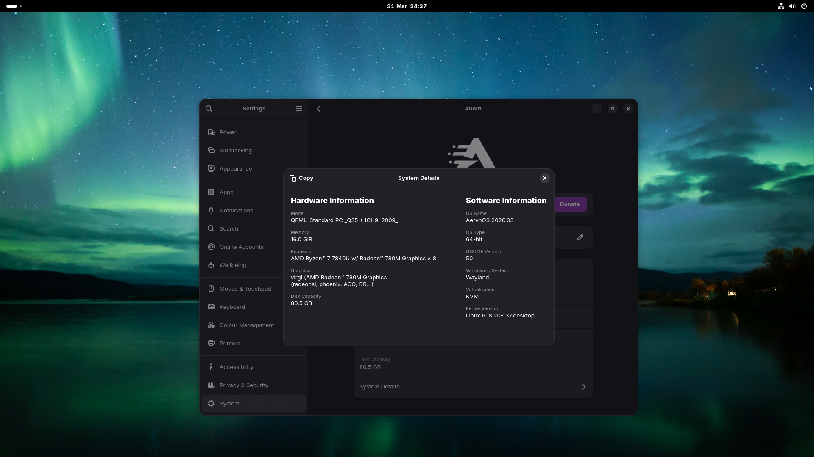
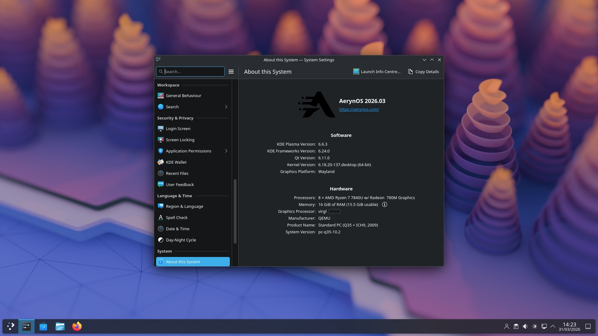

# AerynOS: March 2026 project update

Another month brings another project update. In some respects, March has felt somewhat quieter than usual for the project. However, in the background, things have been fairly busy on the development front, as we prepare for larger and more visible tooling updates to land in the months to come.

On the packaging front, notable package & stack updates include GNOME 50, KDE Plasma 6.6.3, LLVM 22.1.1, Wayland 1.25.0, QT6.11.0, FFmpeg 8.1 and mesa 26.0.3 which have kept our builders busy with a significant number of package builds and rebuilds. The team mentioned last month that there is a soft-freeze in place for our repository, in terms of accepting new package recipes. This is not a full freeze as packages with little or no reverse dependency rebuild chains are still being accepted where we believe they will prove useful.

The development work this month has centered around the tooling we offer in terms of recipe updates and how we can better support bootstrap builds on the boulder side, along with the usual clean-up and refactoring work across the moss and boulder code bases.

Lastly, we want to take a moment to thank Framework for their on-going hardware sponsorship of our project. This month, they have provided the project with an AMD AI 300 based Framework 16 that Joey Riches is now using as a dedicated device for AerynOS development.

## What’s new in the distro

Package / stack updates for this iteration include:

- GNOME 50.0
- KDE Frameworks 6.24.0
- KDE Gear 25.12.3
- KDE Plasma 6.6.3
- awww 0.12.0
- dankmaterialshell 1.4.4
- firefox 149
- fish 4.6.0
- fresh 0.2.20
- jujutsu 0.39.0
- linux 6.18.19
- mangowm 0.12.7
- mesa 26.0.2
- pipewire 1.6.2
- qemu 10.2.2
- riftbar 0.1.8
- thunderbird 149.0
- wine 11.5
- dash 0.5.13.2
- wlroots 0.19.3
- wayland 1.25.0
- maven 3.9.14
- gparted 1.8.1
- kitty 0.46.1
- systemd 257.13
- zls 0.15.1
- sudo-rs 0.2.13
- llvm 22.1.1
- Qt6 6.11.0

... along with sundry additions and updates.

## Desktop Updates

### Gnome

This month sees a significant update to the GNOME stack with the delivery of [GNOME 50](https://release.gnome.org/50/). We have not received any reports of any issues but if you do find any bugs, please do report back to us via [GitHub Issues](https://github.com/AerynOS/recipes/issues) or through our [Zulip](https://aerynos.zulipchat.com/) community.

Some key updates include:

- Improved parental controls
- VRR and Fractional Scaling are now stable and enabled by default
- Wayland only, coming in line with AerynOS' default of having no X11 session

Plus many more features and fixes. 

### KDE Plasma

KDE Plasma has been updated to [6.6.3](https://kde.org/announcements/plasma/6/6.6.3/), KDE Frameworks to 6.24.0 and KDE Gear to 25.12.3. With this update, Plasma Login Manager has been promoted to become the default KDE install option in lichen, with SDDM being the backup alternative.

The latest KDE Plasma update brings:

- KWin's screencasting feature has become robust when using PipeWire 1.6 or newer
- Reduced CPU and GPU load for full-screen windows for screens using more fractional scale factors
- Improve support for mice with high-resolution scroll wheels in the built-in remote desktop server

### Wayland Compositor Environments

Our packaging community has really taken to the Wayland Compositor Environment choice we have in AerynOS. With new packagers getting involved with AerynOS, we are seeing faster package updates and submissions for packages that specifically enhance people's ability to rice their environments just the way they like them.

A few key updates this month include:

- mangowm 0.12.7
- dankmaterialshell 1.4.4
- elephant 2.20.3
- bluetui 0.8.1
- impala 0.7.4
- awww 0.12.0
- riftbar 0.1.8

On top of this, several packages have been rebuilt for better performance, support or defaults. The default terminal in our Sway package set has been swapped from alacritty to foot as this is the default terminal proposed by Sway itself.  Elephant has had upstream support for moss included and this version has now been added to our own repository. Niri has seen a few upstream improvements backported into our repository also.

## Infrastructure and Tooling Updates

### Use CDN for the default volatile stream

As part of our content delivery strategy, we had already moved to using a CDN for delivering updates through moss on our Unstable repository. This month, we have made the transition to also using the CDN for our Volatile repository as well.

The Volatile repository is primary used for those who do their own packaging and/or submit packages to our repository. This change helps speed up downloads for those users as they disproportionately engage with our repositories for packaging purposes.

We have updated our documentation accordingly, so if you do any packaging work on AerynOS, please refer to the updated documentation on our [dotdev](https://aerynos.dev/packaging/workflow/) site.
 
### moss: Search for binaries

Moss searching has been updated to add the ability to search by binary provider. 

**More detail to be provided**

### moss: Allow removal of ranges of states

Moss works by utilizing a Content Aware Storage architecture. This means that all package related files are stored in a deduplicated manner in the CAS and then hardlinked to transaction numbers /usr trees. This has the benefit of allowing for all historic states of a system to be kept without significant overhead of duplicating the majority of all data, as would happen with simple snapshots.

Space is not infinite on our systems however, so moss was designed to be able to delete transactions. This could be done, either individually, or by automatically deleting all but the last 10 transactions. Any unique files in the CAS related to these transactions would be deleting, help free up space on a users system.

Thanks to a contribution by one of our long time trusted contributors, [AnonAlly](https://github.com/AnonAlly), this moss state removal command now has the ability to either delete multiple states by state number or by ranges of states. This is a nice usability improvement as otherwise, users had to individually delete states one at a time. Given that some of our systems are now reaching into the hundreds of states, this is a nice time saving QoL improvement.

**TODO: Add example invocation.**

### boulder: Add support for control files

After some prodding from Reilly, ermo and tarkah designed a flexible control file format for boulder, which is initially intended to help support bootstrapping efforts for major stack updates.

During these updates, the tests within our recipes can fail though this is expected behaviour. In part to conveniently address this failure mode, the control file format enables packagers to override, prepend or append phases within our build recipes.

Initially, we have created a shared control file that outright disables tests, which can be enabled by symlinking it in next to recipes whilst bootstrapping them. This will enable initial bootstrapping builds to succeed before final builds are completed with the control file removed and tests therefore reenabled.

The benefit of the shared control file approach in this instance, is that it does away with the need to go in and manually edit each recipe to disable (and subsequently re-enable) the check phase for the stack that is being bootstrapped.

We have built the control file using the KDL format as part of our wider transition to this file format within our tooling.

To those wondering why we didn't just add a boulder build flag for this, the reason is that we have a few other future use cases in mind for this feature that are also projected to benefit from a control file, hence settling on the current design.

## Wider Project Updates

### Recipe repository REUSE compliance

Unless otherwise stated, all packaging recipes in our recipes repository are available under the terms of the [MPL-2.0](https://spdx.org/licenses/MPL-2.0.html) license. This was managed both at the repository level in the readme and as a header on individual files. 

Over time, the application of our header text has varied, specifically in relation to our move from the SerpentOS name to AerynOS. Fabio has reviewed the best practices for ensuring REUSE compliance and updated all files in our recipe repository to standardize the header text to these best practices.

For anyone doing local packaging work, you will need to ensure you update your local forks of the recipe repository and update boulder to ensure that you are working from the latest version of the files, and that new recipe files are created with the correct header text. You may also need to rebase existing PRs to ensure compliance to the new standard.

In addition, a new CI process has been created to check for this REUSE compliance for package recipes. This will ensure compliance with our licencing standards into the future rather than letting the files deviate over time again.

### Framework hardware sponsorship

Back in August 2024, Framework provided the project (then SerpentOS) with an AMD Ryzen 7840u based Framework 13. At the time, this was helpful for Ikey (our project founder and former project lead) to have a separate and dedicated laptop for working on the project following the appropriate hardware enablement.

Fast forward to 2026, the Framework team have provided additional hardware sponsorship in the form of an AMD AI 300 based Framework 16 laptop which is being utilized by Joey Riches. Our project, whilst still in Alpha has matured significantly since 2024 so once Joey disabled secure boot, the installation occurred without a hitch without any further hardware enablement required.

Joey is coming from a desktop Ryzen 3000 based system so coming to this new Framework 16 has provided a nice upgrade in performance whilst also acting as a dedicated device for this work on AerynOS.

Unfortunately, when Ikey stepped away from the project, we lost access to the Framework 13. However, I (NomadicCore) also personally own an AMD 7840u based Framework 13 so can ensure continued hardware support for the device.

As a team, we like the repairable nature of Framework hardware and appreciate them supporting an up-and-coming distro such as ours!

## ISO refresh

We are releasing our newest Alpha ISO, AerynOS 2026.03, which includes the updates we've worked on since the start of March, and which features the 6.18.20 kernel.

As usual, this is a Live GNOME ISO that merely serves as a delivery vehicle for our Alpha/PoC `lichen` installer. Hence, installing AerynOS requires a network connection over which the latest pkgsets can be downloaded and subsequently installed onto a hard drive.

We did notice an issue in our 2026.02 ISO whereby it would not boot from Ventoy USB sticks. The issue reoccured with our 2026.03 ISO and we believe we have identified the issue. We have raised an issue with Ventoy and hopefully will have this resolved soon.

The link for our 2026.03 ISO can be found on our [download](/download/) page.

## Next Steps

### Python upgrade and repository rebuild

Next month, we are aiming to upgrade our Python stack (which is a notoriously invasive undertaking), along with doing a full repository rebuild across our ~1500 recipes. This coincides with us having landed LLVM 22 this month.

Our last full repository rebuild was completed in June 2025, following the then recent transition to our Rust-based infrastructure. With almost a year of infrastructure and tooling updates, it will be interesting to see how the rebuild process pans out this time.

The AerynOS build infrastructure currently runs with four permanent builders. In addition, it is trivial for us to add temporary builders to help manage peak demand periods.

For this rebuild trek, we will likely add one or two temporary builders to help keep the queue flowing past larger packages that would otherwise clog up the queue.

Full repository rebuilds like this are important for a couple of reasons:

- They test our infrastructure and help highlight any deficiencies that we need to address
- They ensure full repository ABI compliance, to help minimise the risk of packages not working due to incompatible dependencies
- They help ensure that our recipes are valid and up to date
- They demonstrate that we *can* rebuild our repository if we need to for whatever reason

The current iteration of our infrastructure is at ~2750 builds, and is no longer a frustration point for the team when submitting packages for build.

This stands in stark contrast to our original Proof of Concept infrastructure that, in the background, became quite fickle and had increasingly become a source of frustration until it was replaced.

### Versioned Repositories, phase2

This month has been steadily building towards phase2 of our Versioned Repos feature set. We highlighted this in last month's blog post, and the aim remains to be to teach moss how to seamlessly upgrade itself on user systems, in a way that automagically enables support for new repository and `.stone` format features. 

This will set us up nicely from an "install once, update forever" perspective, as we will always be able to add new features to our tooling without requiring fresh installs or manual upgrade interventions on user systems.

## Supporting the project

Outside of financial donations through Stripe and Ko-fi mentioned above, we are always looking for people to get involved with development and packaging efforts and welcome anyone curious about AerynOS to join us in our Zulip server!

If any hardware vendors are interested in sponsoring the project either financially or through hardware sponsorship, this would be warmly received.

If you wish to discuss other sponsorship details, please reach out to us at contact@aerynos.com.

<a style="font-weight: bold;
          color: white;
          background-color: #8b00a3;
          padding: 10px 20px;
          text-decoration: none;
          text-align:center;
          border-radius: 5px"
   href=/sponsor/>Click here to Sponsor the project via Stripe or Ko-fi</a>

## Thank You!

We are very grateful for your support, be it financial or via project contributions in the form of carefully written bug reports, code contributions, design contributions, documentation updates, general feedback, package updates and overall enthusiasm around the project.

In that vein, we would also like to (in this case, once again) give [Framework Computers](https://frame.work) a shout out for their generous support in the form of hardware sponsorship for project members now and in the past.
