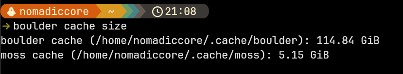
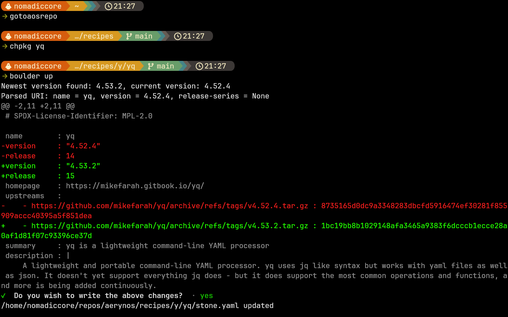
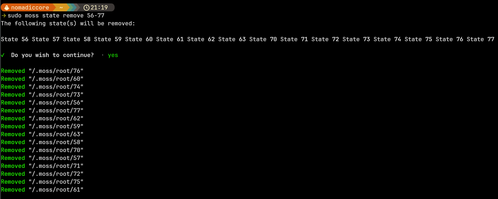
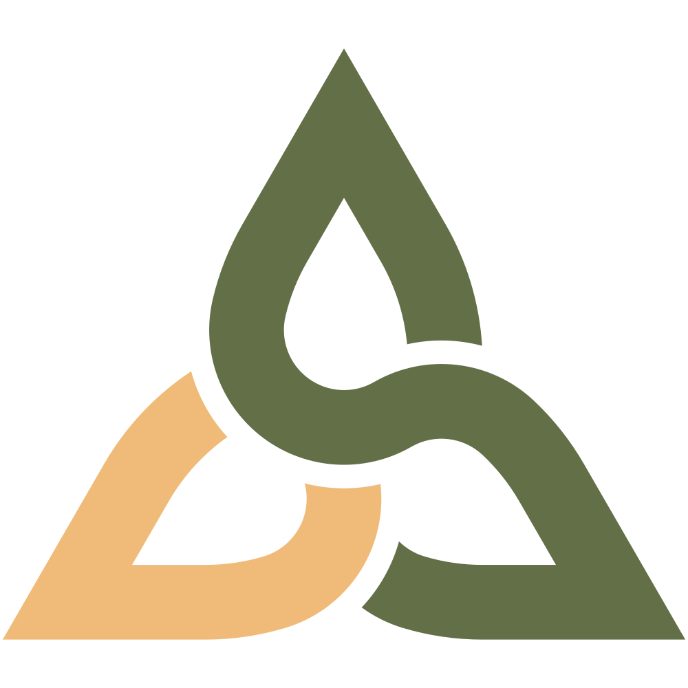
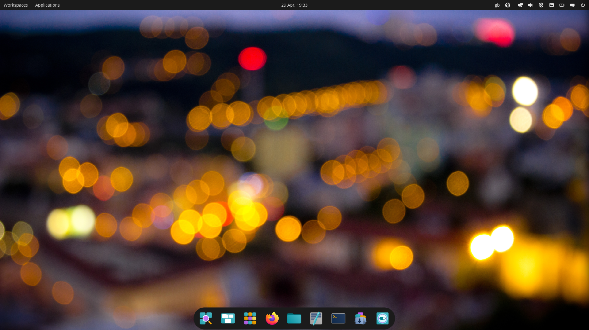

No, this isn’t a suspicious phishing attempt! AerynOS has officially gone through a rebrand 🎉

Over the course of April, we rolled out a new logo and refreshed color palette across the entire project. It took a bit of time to thread this through every corner of the OS and our web presence, but we’re happy to say it’s now fully in place.

Alongside the new branding, we’ve also been collaborating with community member *ziegenmelker5*, licensing a selection of his photography for use as wallpapers (and the title image above). A handful of these have already landed in our artwork repository and will show up on user systems after the next sync. On top of that, the team has created an abstract wallpaper inspired by the new logo, so there’s a bit of something for everyone.

A big chunk of April was spent improving our core tooling, especially `moss` and `boulder`:

Boulder:
- `boulder cache size` to show cache size of both boulder and moss.
- `boulder cache clean` to free up space on system by deleting the cache.
- `boulder recipe update` now uses `ent` to check for recipe updates and approprately updates the `stone.yaml` accordingly.

Moss:
- `moss state prune` is now faster and shows a progress bar when removing states.

In addition, we’ve continued our reuse compliance work, extending it from our recipes repository into our os-tools repository. This brings us closer to full compliance across the board.

Lastly, we have expanded our kernel configurations and now offer an LTS, stable and gaming kernel, though switching away from the stable kernel isn't yet a simple process.

## What’s new in the distro

Package / stack updates for this iteration include:

- COSMIC DE 1.0.11
- GNOME 50.1
- KDE Frameworks 6.25.0
- KDE Gear 26.04.0
- KDE Plasma 6.6.4
- dankmaterialshell 1.4.4.1
- dash 0.5.13.3
- docker 29.4.1
- eza 0.23.4
- firefox 150
- fresh 0.2.23
- jujutsu 0.40.0
- kitty 0.46.2
- kmscon 9.3.5
- linux-gaming 7.0.2
- linux-lts 6.18.25
- linux-stable 7.0.2
- llvm 22.1.4
- ly 1.3.2
- maven 3.9.15
- mesa 26.0.5
- niri 26.4
- ntpd-rs 1.7.2
- openvpn 2.7.2
- pipewire 1.6.4
- qemu 11.0.0
- python 3.14.4
- rust 1.95.0
- thunderbird 150.0
- uutils-coreutils 0.8.0
- wine 11.7
- zig 0.16.0
- zls 0.16.0
- zed 1.0.0

... along with sundry additions and updates.

## Infrastructure and Tooling Updates

### boulder cache subcommands with clean and size options

This month, Joey has added additional subcommands for boulder to calculate cache sizes (both for boulder and moss). Additionally, a `boulder cache clean` command was added that will delete the cache to help free up space on a user's system.

This will be particularly helpful for our packagers who after building packages will have increasing amounts of space taken up by the boulder cache. The team itself frequently moves between our `unstable` and `volatile` repositories so having the ability to delete the moss cache will also be helpful to ensure predictable outcomes.

### boulder recipe automation

Using our self built `ent` tool (which integrates with [Anitya](https://release-monitoring.org/) for release monitoring), we’ve taken another step toward automating package maintenance by combining it with our `boulder recipe update` command. When invoking this command, boulder will:

- Check for updates using ent
- Resolve the source URL of the latest update
- Download the latest version source archive
- Appropriately update the stone.yaml recipe

…all in one go.

There’s also JSON output support, which will be useful as we expand our automation tooling further down the line.

For simple package updates, this helps consolidate some of our mundane workflow steps and help make packaging a more streamlined affair on AerynOS, letting packagers focus on logic and problem solving, not administrative minutiae.

### Faster `moss state remove`

State removal is now faster thanks to parallelization, and it finally provides real-time feedback via a progress bar.

Behind the scenes, moss intelligently handles our deduplicated CAS storage, which is why removal order might look a little unusual, it’s working out which files are safe to delete across shared states.

### Improved `moss search`

A new contributor, otherJL0, has made some great improvements to our `moss search` command:

- Support for searching on provider syntax e.g. `sysbinary(...)`
- Smarter grouping of results based on name or summary
- Highlights matched substrings in output by name or summary

This is especially useful for packaging workflows as our packagers can get a better understanding of which package provide a given binary or library.

### Continuation of our Versioned Repository feature set

We’ve continued work on phase 2 of our Versioned Repositories feature, and a draft PR with the basic workflow and new configuration format has been opened for moss. The vessel repository manager companion work has been mapped out, but no PR has yet been opened for this.

As mentioned in previous posts, the key goal of phase 2 is to enable moss to upgrade itself seamlessly, which in turn enables us to add support for new repository features and `.stone` format features without manual intervention.

In practical terms, this moves us closer to a true install once, update forever model, where we can evolve the capabilities of the system over time, without leaving users on older moss versions behind.

We hope to land the phase 2 related feature PRs in the near future.

## Wider Project Updates

### New Branding: A Fresh Look for AerynOS

April was a big month for us here at AerynOS, as we made some exciting strides in our rebranding efforts. We’re thrilled to finally roll out a brand-new logomark, a version of the triquetra that was originally proposed by community member *Petru Jenach*, and later refined by community member *platlas* when AerynOS was rebranded from SerpentOS last year.

Working closely with *platlas* and the wider community, we’ve spent the last few months refining the design and selecting a brand new color palette. Special thanks to *sammypanda*, who suggested the color scheme that we ended up using.

So, what’s behind the triquetra? This symbol has deep meaning across cultures, but we’ve chosen it particularly for its Irish roots, as a nod to AerynOS’ founder, Ikey Doherty. The triquetra represents themes of life, death, and rebirth, which felt fitting for a project that’s always evolving. It also symbolizes unity and commitment, values that align with our community driven approach.

Design-wise, we’ve divided the three points of the triquetra into two colors: green and orange. The green is all about nature, while the orange ties directly to Rust, the programming language at the heart of our project. We love how the orange section can be interpreted as an ‘O’ and the green section as an ‘S,’ coming together to form "OS." It’s subtle, but we think it’s a nice touch.

We’re really excited about this fresh new look, and the fact that it’s something the whole community helped us shape. We’ve spent the month rolling it out across the operating system and our web presence, and we’re happy with how it all ties together.

### New Wallpapers: Bringing Nature to Your Desktop

Next to the new logomark, we’ve also worked with community member Gabriel Janich (aka *ziegenmelker5*) to bring some stunning new wallpapers to AerynOS. Gabriel has an amazing collection of photos, and choosing just a handful to feature was no easy task!

In the end, we selected seven that we felt best represented the spirit of AerynOS. You’ll see two of them as the new default wallpapers for Cosmic and GNOME (we have some work to do to properly customise our KDE Plasma defaults). Each one has its own vibe, but all of them bring a touch of nature and tranquility to your desktop.

We hope these new wallpapers, paired with the fresh logo, help make your AerynOS experience even more enjoyable as you dive into the project in the coming days and months.

### Python stack upgrade

We mentioned last month that we planned a Python stack upgrade. Due to diligent prior preparation work by Reilly, this stack upgrade landed in a fairly seamless manner with only minor fixes required over the course of a day. The process saw Python being upgraded from 3.11 to 3.14.4 as of this writing.

Our python stack isn't currently very large (only around 200 packages) which also played a role in the fairly seamless nature of this update. From what we can tell, the updated has enabled our early adopters to continue to use Python packages without any regressions.

### Kernel updates

We have expanded our kernel offering to three distinct options:

1) linux-lts (6.18): Latest LTS release for our most stable offering.
2) linux-stable (7.0): Follows the latest stable release with very few optimisations for a current stable offering.
3) linux-gaming (7.0): Also follows the latest stable release with patches for handheld gaming and misc. performance optimisations.

Whilst these kernels are available in the repository, switching away from our linux-stable kernel isn’t a smooth process just yet. 

Improving that experience is on our roadmap.

## ISO refresh

We are releasing our newest Alpha ISO, AerynOS 2026.05, which includes the updates we've worked on since the start of April, and which features the 7.0.2 linux-stable kernel.

As usual, this is a Live GNOME ISO that merely serves as a delivery vehicle for our Alpha/PoC `lichen` installer. Hence, installing AerynOS requires a network connection over which the latest pkgsets can be downloaded and subsequently installed onto a hard drive.

Please note that for now, Ventoy cannot be used to install AerynOS ISOs, however multiple other options work such as Etcher, DD and GNOME Disks.

The link for our 2026.05 ISO can be found on our [download](/download/) page.

## Next Steps

The primary focus on the development side is to attempt to get the Versioned Repos, phase2 feature over the finish line as soon as feasible.

Frankly, we have been so focused on getting the Versioned Repos, phase2 feature *right*, that we've scarcely had the mental bandwidth to focus on anything else from the perspective of our larger development arc.

That said -- and assuming we succeed in landing the Versioned Repos, phase2 feature soon -- we will then spend some time on sketching out the details of the upcoming avenues of development that will open up as a result. 

In parallel to that, we hope to spend some time getting our systemd-preset story straight from a packaging perspective, which will give us the ability to enable services as a packaging operation. This will be especially useful when leveraged via our declarative system-model capabilities.

## Supporting the project

Over the last year, the project has been through a significant period of change. As detailed in our [October 2025 blog post](https://aerynos.com/blog/2025/10/31/#donations), we had to update our sponsorship accounts to receive future sponsorship funds once it became clear our previous project leader had permanently stepped away from the project.

This left us in a position where we had to build up our sponsor income from scratch having lost previous sponsors. We are very greatful that many sponsors (old and new) have joined or stayed with us on this journey and our income is again able to cover our fixed project costs with a little surplus each month.

As of this month, we are now in a net neutral position having borne the project costs for a year whilst receiving sponsorship income for 6 months. We are **very** appreciative of all who have ever sponsored the project, we wouldn't be here without your support! ❤️

Ideally we would like to grow our monthly income (and therefore surplus). Doing so would allow us to:

1. Support our staff who currently work on a voluntary basis
2. Scale and/or upgrade infrastructure over time
3. Consider purchasing hardware for compatibility testing
4. Fund future initiatives for the betterment of the project

<a style="font-weight: bold;
          color: white;
          background-color: #626f47ff;
          padding: 10px 20px;
          text-decoration: none;
          text-align:center;
          border-radius: 5px"
   href=/sponsor/>Sponsor AerynOS</a>

If you wish to discuss other sponsorship opportunties, such as hosting or hardware sponsorship, please reach out to us at contact@aerynos.com.

## Thank You!

We are very grateful for your support, be it financial or via project contributions in the form of carefully written bug reports, code contributions, design contributions, documentation updates, general feedback, package updates and overall enthusiasm around the project.

We hope that you will continue showing enthusiasm for our project, and that you will want to get involved in whichever way, shape, or form works for you!
