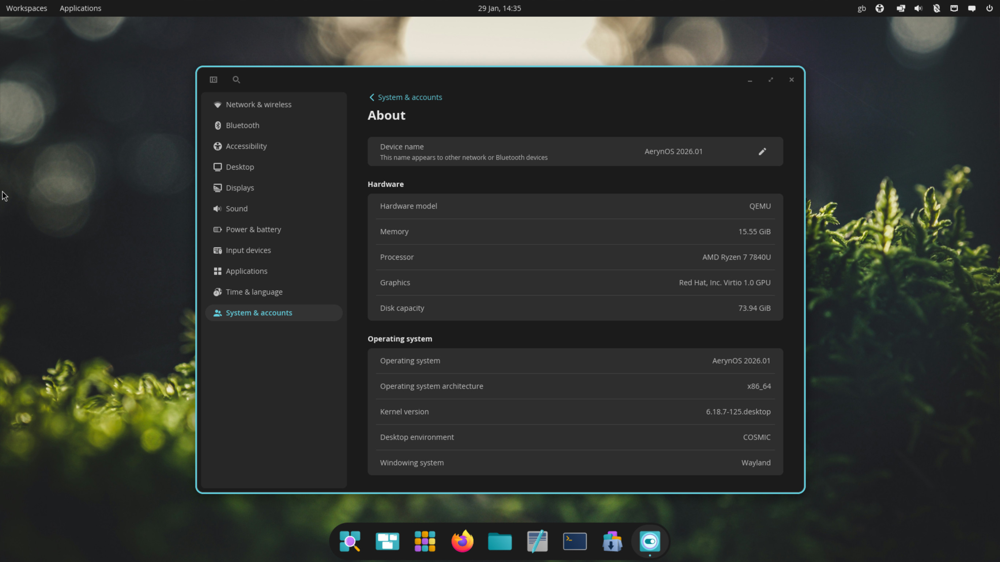
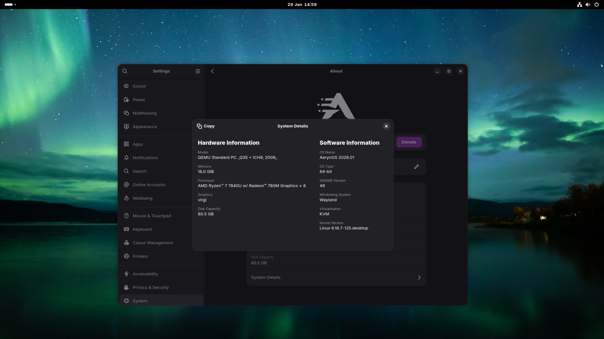

import Kofi from "@/components/ui/Kofi.astro";
import { Aside } from "@astrojs/starlight/components";

# AerynOS: January 2026 project update

Kicking off 2026, activity across the AerynOS project has been moving at pace. As covered in our 2025 retrospective, last year the team laid the groundwork for the project's future growth and development. Starting off 2026, the team is building upon this foundation to keep delivering progress across the project.

From a core tooling perspective, we are preparing for the next phase of our Versioned Repository feature set. During January, we have been refining our existing codebase to make future improvements easier to implement. Once delivered, moss will be able to update itself seamlessly through what would otherwise have been breaking changes to its codebase. This functionality will be very important for our long term goals as a rolling release distro where you never have to reinstall to receive the latest updates.

Progress has been made around our branding with efforts towards a new website design and a healthy discussion and proposals for a new AerynOS logo.

You may recently have seen that AerynOS is taking a stronger stance against the use of LLMs and generative AI. Our [LLM policy](https://github.com/aerynOS/.github?tab=contributing-ov-file#llm-contributions) can be found on GitHub and will be replicated on our website in due course.

Additional progress has been made project-wide on our documentation and we have also made improvements to our CDN setup for improved package delivery.

Our efforts are seem to be received well, as we are seeing an influx of new members joining our [Zulip server](https://aerynos.zulipchat.com/) and getting involved with AerynOS, whether through general discussion or through packaging efforts. We have also seen a jump in our followers across our various social media accounts and generally a more positive reception of what AerynOS is trying to achieve in the Linux space.

## What’s new in the distro

Package / stack updates for this iteration include:

- COSMIC 1.0.3
- GNOME 49.3
- KDE Frameworks 6.22.0
- KDE Gear 25.12.1
- KDE Plasma 6.5.5
- brush 0.3.0-dev (bash compatible shell written in Rust)
- dankmaterialshell 1.2.3 (build your own wayland desktop experience in material design style)
- firefox 147.0.2
- fish 4.3.3 (user friendly shell built w/ Rust)
- foot terminal 1.25.0 (fast, wayland-native terminal emulator)
- ghostty terminal 1.3.0-dev (virtual terminal written in zig)
- glibc 2.43+git.144ba302
- lact 0.8.3 (gui for tweaking gpu voltages, fan curves and frequencies)
- linux 6.18.7
- mangowc 0.10.10 (wayland compositor with eye candy effects)
- mesa 25.3.4
- nodejs 24.13.0
- pipewire 1.4.10
- prism-launcher 10.0.2 (minecraft launcher)
- qemu 10.2.0
- quickshell 0.2.1 (building blocks for wayland compositor-based desktop experiences)
- ruby 4.0.1
- thunderbird 147.0.1
- vscode 1.108.2
- vscodium 1.108.10359
- wine 11
- zed 0.218.7 (text editor built w/ Rust)

... along with sundry additions and updates.

## Desktop Updates

### Cosmic

Given System76's move to a more regular release cycle for [Cosmic DE](https://system76.com/cosmic), we are able to land updates to our repository more frequently. This month, System76 landed Cosmic 1.0.3 with some key updates including support for rounded corners and window shadows across all applications and additional appearance settings being made available.

<Aside title="Cosmic">

AerynOS is following System76's "Epoch" git branch for Cosmic DE. This is where System76 stages new updates to the Cosmic ecosystem before publishing new point releases. As such, our Cosmic package is actually somewhere between 1.0.3 and 1.0.4. 
    
Given that Cosmic 1.0.4 has been released, it will be included in our repository shortly. It may already be there by the time you read this blog post.

</Aside>

### Gnome

This month sees the inclusion of [Gnome 49.3](https://discourse.gnome.org/t/gnome-49-3-released/33609) which is a stable bug-fix release with updates across the Gnome stack. 

Some key updates include:

- Nautilus file manager no longer wastes resources on images with larger dimensions
- GNOME Control Center fixes for time zone searching and monitoring app filter changes in the Applications panel
- Loupe improvements in performance

Plus many more fixes. See the upstream [changelog](https://download.gnome.org/teams/releng/49.3/NEWS) for more details.

### KDE Plasma

KDE Plasma has been updated to [6.5.5](https://kde.org/announcements/plasma/6/6.5.5/), KDE Frameworks to 6.22.0 and KDE Gear to 25.12.1.

The latest KDE Plasma update brings:

- Improved XWayland app support
- Krunner having better matching algorithms for what users are searching for
- A bug fix to kwin to properly handle drag-and-dropped text

### New Wayland Compositor Environments

With the increased interest surrounding AerynOS, we have seen some new contributors join the community and wanting to package up their favourite wayland compositors and supporting packages. Hence, after some mentoring, MangoWC and a gaggle of ancillary packages were landed this month, and they join the existing Niri and Sway wayland compositors in the package repository.

As a result, if you're the sort who prefers to assemble your own Desktop Experience, we now have foot, quickshell and dankmaterialshell as a few examples of packages you can use as a base to make your Desktop Experience "just so".

As a reminder, we do not include MangoWC, Niri or Sway as options to install directly from our `lichen` installer. Users interested in building their own Desktop Experiences on AerynOS can use our `terminal-only` option and then install their preferred Wayland Compositor and associated packages of choice from the command line.

<iframe title="Show &amp; Tell: MangoWC on AerynOS" width="1280" height="720" src="https://exquisite.tube/videos/embed/1R1WCHZyeGiQPKouVRMBPn" style="border: 0px;" allow="fullscreen" sandbox="allow-same-origin allow-scripts allow-popups allow-forms"></iframe>

<Aside title="Why not use our system-model?">

Our new system-model approach can be used as a way of significantly simplifying the process of setting up a new AerynOS install by declaratively stating which packages you want installed on your system from a given repository (currently either Unstable or Volatile) and even being able to lock your environment to any given fixed-in-time stream update tag.
    
For more information about our system-model approach, please refer to the our previous [2025 in retrospect blog post](https://aerynos.com/blog/2026/01/2025-in-retrospect/#system-model)

</Aside>

## Infrastructure and Tooling Updates

### debuginfod

This month, courtesy [Joey Riches](https://github.com/joebonrichie), we added a `debuginfod` service hosted at https://debuginfod.aerynos.dev! For those unaware, [debuginfod](https://sourceware.org/elfutils/Debuginfod.html) is a service that finds and collects debug information in packages and hosts them to be downloadable over a simple Web API. 

In practice, this means that downstream consumers such as `gdb` can automatically download the correct debuginfo files matching an executable's build-id. No more manually searching for and installing the correct `-dbginfo` packages to successfully populate a backtrace with symbols.

To use AerynOS's debuginfod service ensure you have `https://debuginfod.aerynos.dev` in the `$DEBUGINFOD_URLS` environment variable. Assuming you have `libdebuginfod` installed, this should be set up to work out of the the box.

`-dbginfo` packages are still available in the repository in case you do not wish to use debuginfod, or your tool of choice doesn't yet support it.

This service was only possible due to the work [Cory Forsstrom](https://github.com/tarkah/) put in that made our custom `.stone` binary interface available over [FFI](https://doc.rust-lang.org/nomicon/ffi.html) to C via `libstone`. This in turn allowed him to write a downstream patch to `libarchive` supporting reading and extraction of our `.stone` format.

In turn, the debuginfod service uses libstone to extract debuginfo files from our repository pool.
 
### moss error handling

The team have started work on refactoring error handling in `moss` with an early benefit being that download/unpacking errors will now mention the specific package that caused the error.

This is useful when troubleshooting, as it allows us to diagnose whether there is an issue with the user's internet connection, or with the package itself on our server.

This error handling workstream will continue in the background to further improve the quality of human readable error output in our tooling.

## Wider Project Updates

### Website redesign

It has been clear to us for a while that the AerynOS website needs an update and this is something we have highlighted in previous blog posts. Following a review, the team has settled on using the Hextra theme on the Hugo static site generator.

Without going into a lot of detail, the Hextra theme is well maintained and has a lot of functionality built-in, meaning it is well suited to our use case.

NomadicCore has created a new branch on the [dotcom](https://github.com/AerynOS/dotcom/tree/NewSite) repository to work on this in the background. Given the move between Static Site Generators and more generally the different content we want to present on the site, there is still a fair way to go.

If you are interested or experienced in website design and want to help out, join our [Zulip](https://aerynos.zulipchat.com) server and get to know the team.

### CDN hit rate

Last year, the team set up Cloudflare as a CDN for our package repository and saw an improvement in download speeds. This was our first real experience administering Cloudflare and we left it pretty much in its default configuration.

This month, we spent a little time tweaking which parts of our repository it was caching for how long. The result has been a respectable jump in the cache hit rate.

The end result should serve to increase the consistency and speed of downloads within moss when using AerynOS from the unstable stream.

### Documentation

CookieSource and NomadicCore have continued working on the [documentation](https://aerynos.zulipchat.com/) site over the last month.

The team have also updated documentation on the GitHub org including topics such as contributing, licensing, readmes and more. Some of these had fallen behind our latest position or had never been adequately fleshed out.

This effort is all intended to help interested parties get a better understanding of AerynOS and help them be able to contribute more quickly.

Notable changes include:

- A new "Creating a new package recipe" [page](https://aerynos.dev/packaging/workflow/creating-a-new-recipe/)
- Addition of a "How to submit a PR" [page](https://aerynos.dev/packaging/workflow/submitting-a-pr/)
- The ability to view our documentation site as a single [PDF](https://aerynos.dev/aerynos.pdf)
- Updates to our contributing.md file across our GitHub organisation
- The introduction of a policy around **prohibiting the use of LLMs when engaging with AerynOS**

### GitHub vs Codeberg

One area of potential interest is around our use of GitHub. Over time, the team has become increasingly dissatisfied with GitHub for various reasons, including the increased push towards AI and the specter of not having control / sovereignty over our code and/or being locked out with no warning.

Looking to other solutions, Codeberg has come up as a potential alternative and one which the team has started using for internal operational documentation and personal projects, with the initial experience being generally positive.

Codeberg doesn't do everything that GitHub can do, so if the team does look at moving its core repositories over, this would need to be planned carefully to ensure a smooth transition.

As and when we do make the transition to Codeberg, we would also like to sponsor them at the same time. An important tenet of AerynOS is to support and promote open source projects where we can. By way of example, its why we use Zulip (and previously Matrix) over something like Discord. 

Sponsorship, where we are able, is another way we feel we can support the open source community and as our own sponsorship / income grows, we will be in a better position to contribute to the upstream projects on which we rely.

## ISO refresh

We are releasing our newest Alpha ISO, AerynOS 2026.01, which includes the updates we've worked on since the start of December, and which features the 6.18.7 kernel.

As usual, this is a Live GNOME ISO that merely serves as a delivery vehicle for our Alpha/PoC `lichen` installer. Hence, installing AerynOS requires a network connection over which the latest pkgsets can be downloaded and subsequently installed onto a hard drive.

The link for our 2026.01 ISO can be found on our [download](/download/) page.

## Next Steps

We have spent the month of January taking stock of our future development direction, including short and medium term goals.

This has resulted in several nice refactors to how moss works internally, which will in turn make it significantly easier for us to implement some of the medium term features we have planned. It has also already helped us prepare a few planned features, such as better error messages and the in-progress `moss fetch` feature, which can be used to download .stones in advance for testing purposes.

Next to that, we are steadily working towards delivering the Versioned Repos, phase2 infrastructure feature set, which is about teaching moss how to seamlessly auto-update itself across breaking on-disk moss-format changes with no user-interaction.

Currently, we are focusing on defining the necessary repository disk-layout and the format of the file at the root of the moss-format repo. This  will show moss which updates need to be made in which order before the new package repository versions -- containing new packages that rely on new package-management features -- can be used.

Once complete, we will likely move our current repository layout to a `legacy` folder and test that older installs can update seamlessly in the process.

Due to the work done during 2025 on the infrastructure code-base, enabling the seamless format-upgrade process is now a short-term goal, which -- when achieved -- will in turn open up the ability to focus on medium term goals that were previously gated on this specific functionality.

We're very, very excited about what this will enable us to do in the future!

## Supporting the project

As mentioned in our previous blog post, our sponsorship goals in 2026 will be to continue growing our recurring sponsorships to help recover the backlog of historic project costs, and also to build up towards future hardware investments such as an x86_64-v4 capable builder.

If any hardware vendors are interested in sponsoring the project either financially or through hardware sponsorship, this would be warmly received.

Similarly, we are interested in and open to EU-based CDN sponsorship as a way of strengthening our package delivery and ISO download capabilities, and to lessen our dependency on US-based CloudFlare as a defensive measure. If you are in a position to help make this happen, we would love to hear from you.

If you are following along with our project and are in a position to support us, please consider donating via our Ko-fi page. If you wish to discuss other sponsorship details, please reach out to us at contact@aerynos.com.

<Kofi />

### Thank You!

We are very grateful for your support, be it financial or via project contributions in the form of carefully written bug reports, code contributions, design contributions, documentation updates, general feedback, package updates and overall enthusiasm around the project.

In that vein, we would also like to give [Framework Computers](https://frame.work) a shout out for their generous support in the form of hardware sponsorship for project members now and in the past.
